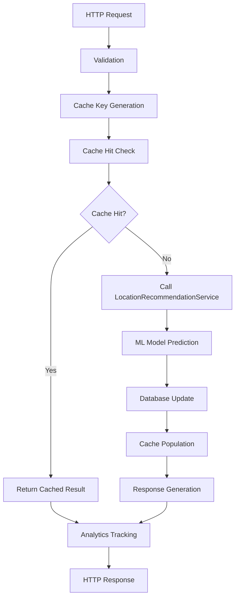

# Controller Package Documentation

## Overview

The `/controller/` package contains Spring Boot REST controllers that define the API endpoints for the Creative Space Finder application. These controllers handle HTTP requests for recommendations, weather forecasts, analytics, system health monitoring, and administrative functions.

## Package Structure

```
com.creativespacefinder.manhattan.controller/
├── AdminController.java           # Administrative functions and authentication
├── AnalyticsController.java       # Usage analytics and performance metrics
├── HealthController.java          # System health monitoring
├── RecommendationController.java  # Core recommendation API
└── WeatherForecastController.java # Weather forecast endpoints
```

---

## AdminController.java

### Purpose
Manages administrative functions including authentication, session management, and cache operations. This controller provides secure access to system management features through session-based authentication.

### Base Mapping
```java
@RestController
@RequestMapping("/api/admin")
```

### Key Components

#### Authentication Dependencies
```java
private final BCryptPasswordEncoder passwordEncoder = new BCryptPasswordEncoder();

@Value("${admin.username}")
private String adminUsername;

@Value("${admin.password.hash}")
private String adminPasswordHash;
```

**Security Design:**
- Admin credentials stored as environment variables
- Password stored as BCrypt hash for security
- No hardcoded credentials in source code

### Authentication Endpoints

#### POST `/api/admin/login`
```java
public ResponseEntity<Map<String, Object>> login(@RequestBody LoginRequest loginRequest, HttpSession session)
```

**Request Body:**
```json
{
  "username": "admin_username",
  "password": "plain_text_password"
}
```

**Authentication Flow:**
1. Validates username against `${admin.username}`
2. Verifies password using BCrypt against `${admin.password.hash}`
3. Creates HTTP session with attributes:
   - `adminAuthenticated: true`
   - `adminUsername: username`
   - `loginTime: current_timestamp`

**Response (Success):**
```json
{
  "success": true,
  "message": "Login successful",
  "sessionId": "session_id_string"
}
```

**Response (Failure):**
```json
{
  "success": false,
  "message": "Invalid credentials"
}
```

#### POST `/api/admin/logout`
```java
public ResponseEntity<Map<String, Object>> logout(HttpSession session)
```

**Functionality:**
- Invalidates the current HTTP session
- Clears all session attributes
- Returns success confirmation

#### GET `/api/admin/validate-session`
```java
public ResponseEntity<Map<String, Object>> validateSession(HttpSession session)
```

**Session Validation Logic:**
- Checks `adminAuthenticated` session attribute
- Validates session hasn't expired (24-hour limit)
- Returns session validity status

**Response (Valid Session):**
```json
{
  "valid": true,
  "username": "admin_username"
}
```

### Cache Management Endpoints

#### POST `/api/admin/warm-cache` 🔒
```java
public ResponseEntity<String> warmCache(HttpSession session)
```

**Purpose:** Manually trigger asynchronous cache warming process

**Authentication:** Required - validates session before proceeding

**Process:**
1. Validates admin session
2. Calls `dailyPrecomputationService.triggerAsyncDailyPrecomputation()`
3. Returns immediately while cache warming runs in background

**Response:**
```
Cache warming started successfully in background!

Process Duration: ~10-15 minutes
Runs in background - you can continue using the app
Cache will be populated automatically when complete
```

**Design Benefits:**
- **Async Execution:** Prevents HTTP 502 errors during intensive operations
- **Non-blocking:** Admin can continue using the application
- **Background Processing:** Uses dedicated thread pool from AsyncConfig

#### GET `/api/admin/cache-status` 🔒
```java
public ResponseEntity<String> getCacheStatus(HttpSession session)
```

**Purpose:** Check cache warming schedule and status
**Authentication:** Required
**Response:** Information about daily cache warming schedule

#### GET `/api/admin/cache-debug` 🔒
```java
public ResponseEntity<Map<String, Object>> debugCache(HttpSession session)
```

**Purpose:** Detailed cache inspection for troubleshooting

**Response Structure:**
```json
{
  "cacheExists": true,
  "statistics": {
    "estimatedSize": 150,
    "hitCount": 1250,
    "missCount": 180,
    "hitRate": "87.41%",
    "missRate": "12.59%",
    "requestCount": 1430,
    "averageLoadTime": "2150.45ms",
    "evictionCount": 5
  },
  "sampleKeys": [
    "Portrait photography_2025-07-25T15:00_soho hudson square",
    "Street photography_2025-07-25T17:00_all"
  ],
  "totalKeys": 150
}
```

#### POST `/api/admin/clear-cache` 🔒
```java
public ResponseEntity<String> clearCache(HttpSession session)
```

**Purpose:** Clear all cached recommendations for testing
**Use Case:** Useful for testing cache warming or forcing fresh ML predictions

### Helper Methods

#### Session Authentication
```java
private boolean isAuthenticated(HttpSession session)
```

**Validation Logic:**
- Checks for `adminAuthenticated` session attribute
- Validates `loginTime` hasn't exceeded 24-hour limit
- Returns boolean indicating session validity

### Data Transfer Objects

#### LoginRequest
```java
public static class LoginRequest {
    private String username;
    private String password;
    
    // getters, setters, toString (password hidden)
}
```

### Security Features

#### Password Security
- BCrypt hashing prevents password exposure
- Environment variable injection prevents credential leakage
- Session timeout limits exposure window

#### Session Management
- 24-hour session expiration
- Automatic session invalidation on logout
- Session validation on all protected endpoints

#### Error Handling
- Generic error messages prevent information disclosure
- Detailed logging for debugging (server-side only)
- Graceful degradation on authentication failures

---

## AnalyticsController.java

### Purpose
Provides comprehensive analytics about API usage patterns, cache performance, and user behavior. These endpoints help optimize system performance and understand usage trends.

### Base Mapping
```java
@RestController
@RequestMapping("/api/analytics")
```

### Analytics Endpoints

#### GET `/api/analytics/popular-combinations`
```java
public ResponseEntity<List<Map<String, Object>>> getPopularCombinations()
```

**Purpose:** Identify most requested activity/time combinations for cache optimization

**Response Structure:**
```json
[
  {
    "activity": "Portrait photography",
    "hour": 15,
    "dayOfWeek": 6,
    "requestCount": 25,
    "lastRequested": "2025-07-25T15:30:00",
    "avgResponseTime": 1250
  }
]
```

**Use Cases:**
- **Cache Prioritization:** Pre-warm popular combinations first
- **Resource Planning:** Understand peak usage patterns
- **Feature Development:** Focus on most-used activities

#### GET `/api/analytics/cache-performance`
```java
public ResponseEntity<List<Map<String, Object>>> getCachePerformance()
```

**Purpose:** Monitor cache effectiveness across different activities and times

**Response Structure:**
```json
[
  {
    "activity": "Street photography",
    "hour": 17,
    "cacheHitRate": "89.5%",
    "totalRequests": 45,
    "avgResponseTime": 850
  }
]
```

**Performance Insights:**
- **Hit Rate Analysis:** Identify cache coverage gaps
- **Response Time Correlation:** Validate cache performance benefits
- **Optimization Opportunities:** Target low-hit-rate combinations

#### GET `/api/analytics/activity-trends`
```java
public ResponseEntity<List<Map<String, Object>>> getActivityTrends()
```

**Purpose:** Understand overall activity popularity and performance

**Response Structure:**
```json
[
  {
    "activity": "Portrait photography",
    "totalRequests": 150,
    "avgResponseTime": 1100,
    "lastRequested": "2025-07-25T16:00:00"
  }
]
```

**Business Value:**
- **Content Strategy:** Focus on popular activities
- **Performance Monitoring:** Track response time trends
- **User Engagement:** Understand activity preferences

#### GET `/api/analytics/hourly-patterns`
```java
public ResponseEntity<List<Map<String, Object>>> getHourlyPatterns()
```

**Purpose:** Identify peak usage hours and activity diversity

**Response Structure:**
```json
[
  {
    "hour": 15,
    "totalRequests": 85,
    "uniqueActivities": 7
  }
]
```

**Operational Insights:**
- **Capacity Planning:** Identify peak load hours
- **Cache Warming Schedule:** Optimize pre-computation timing
- **Infrastructure Scaling:** Plan resource allocation

#### GET `/api/analytics/recent-activity`
```java
public ResponseEntity<List<Map<String, Object>>> getRecentActivity()
```

**Purpose:** Monitor recent system usage (last 7 days)

**Response Structure:**
```json
[
  {
    "activity": "Filmmaking",
    "hour": 14,
    "requestCount": 3,
    "lastRequested": "2025-07-25T14:30:00",
    "cacheHit": true,
    "responseTime": 95
  }
]
```

#### GET `/api/analytics/dashboard`
```java
public ResponseEntity<Map<String, Object>> getDashboard()
```

**Purpose:** Provide executive summary of system metrics

**Response Structure:**
```json
{
  "popularCombinations": 25,
  "avgCacheHitRate": "85.3%",
  "totalActivities": 8,
  "totalRequests": 1250,
  "recentActivityCount": 45
}
```

### Analytics Data Processing

#### Performance Calculations
```java
double avgCacheHitRate = cacheStats.stream()
    .mapToDouble(row -> (Double) row[2])
    .average()
    .orElse(0.0);
```

#### Data Transformation
- Raw analytics data converted to user-friendly formats
- Percentages formatted for readability
- Timestamps standardized across endpoints

### Business Intelligence Features

#### Cache Optimization Insights
- Identify low-hit-rate combinations for targeted cache warming
- Monitor cache performance degradation
- Track cache size and eviction patterns

#### Usage Pattern Analysis
- Peak hour identification for infrastructure scaling
- Activity popularity trends for content strategy
- Geographic usage patterns (via zone selection analytics)

#### Performance Monitoring
- Response time tracking across all endpoints
- Cache hit rate monitoring for performance validation
- Error rate analysis for system reliability

---

## HealthController.java

### Purpose
Provides a simple, unified endpoint for comprehensive system health monitoring. This controller acts as a facade for the detailed health checking logic implemented in `SystemHealthService`.

### Base Mapping
```java
@RestController
@RequestMapping("/api/health")
```

### Health Endpoint

#### GET `/api/health`
```java
public ResponseEntity<Map<String, Object>> healthCheck()
```

**Purpose:** Comprehensive system status check covering all application components

**Response Structure:**
```json
{
  "system": {
    "status": "HEALTHY",
    "version": "3.0",
    "timestamp": "2025-07-25T15:30:00Z",
    "uptimeHours": 72,
    "javaVersion": "17.0.2"
  },
  "database": {
    "status": "CONNECTED",
    "connectionPool": {
      "activeConnections": 1,
      "totalConnections": 1,
      "maxPoolSize": 5
    },
    "dataStatistics": {
      "totalActivities": 8,
      "totalLocationScores": 1500,
      "mlCoveragePercentage": 85.5
    }
  },
  "cache": {
    "status": "ACTIVE",
    "statistics": {
      "hitRate": 0.873,
      "estimatedSize": 150,
      "requestCount": 1250
    }
  },
  "mlModel": {
    "status": "CONNECTED",
    "responseTimeMs": 245
  },
  "weatherApi": {
    "status": "CONNECTED",
    "forecastHours": 96
  }
}
```

### Health Check Categories

#### System Health
- Application uptime and version
- JVM information
- Spring profile status
- Resource utilization metrics

#### Database Health
- Connection pool status
- Data integrity statistics
- ML prediction coverage
- Historical data availability

#### Cache Performance
- Hit/miss rates
- Cache size and utilization
- Response time improvements
- Eviction statistics

#### External Service Health
- ML model API connectivity
- Weather API availability
- Service response times
- Error rate monitoring

### Monitoring Integration

#### Production Monitoring
- Endpoint suitable for load balancer health checks
- Comprehensive status for monitoring systems
- Error conditions clearly indicated

#### Development Debugging
- Detailed component status for troubleshooting
- Performance metrics for optimization
- Resource utilization for capacity planning

### Design Benefits

#### Single Endpoint Strategy
- Simplified monitoring configuration
- Comprehensive system overview
- Consistent response format

#### Service Delegation
- Health logic centralized in `SystemHealthService`
- Controller remains lightweight
- Easy to extend with additional health checks

---

## RecommendationController.java

### Purpose
The core API controller that provides location recommendations based on activities, date/time, and optional zone filtering. This controller integrates caching, analytics tracking, and machine learning predictions.

### Base Mapping
```java
@RestController
@RequestMapping("/api/recommendations")
```

### Dependencies
```java
@Autowired
private LocationRecommendationService locationRecommendationService;

@Autowired
private AnalyticsService analyticsService;

@Autowired
private CacheManager cacheManager;
```

### Main Recommendation Endpoint

#### POST `/api/recommendations`
```java
public ResponseEntity<RecommendationResponse> getRecommendations(
    @Valid @RequestBody RecommendationRequest request)
```

**Request Structure:**
```json
{
  "activity": "Portrait photography",
  "dateTime": "2025-07-25T15:00:00",
  "selectedZone": "soho hudson square"
}
```

**Validation:**
- `activity`: Required, non-blank string
- `dateTime`: Required, valid ISO LocalDateTime
- `selectedZone`: Optional zone filter

**Response Structure:**
```json
{
  "locations": [
    {
      "id": "uuid-string",
      "zoneName": "Washington Square Park",
      "latitude": 40.7308,
      "longitude": -73.9973,
      "activityScore": 8.5,
      "museScore": 9.2,
      "crowdScore": 7.8,
      "estimatedCrowdNumber": 45,
      "crowdLevel": "Moderate",
      "scoreBreakdown": {
        "activityScore": 8.5,
        "museScore": 9.2,
        "crowdScore": 7.8,
        "explanation": "Calculated from ML .pkl file"
      }
    }
  ],
  "activity": "Portrait photography",
  "requestedDateTime": "2025-07-25T15:00:00",
  "totalResults": 10
}
```

### Cache Integration

#### Cache Key Generation
```java
String cacheKey = request.getActivity() + "_" + request.getDateTime().toString() + "_" +
    (request.getSelectedZone() != null ? request.getSelectedZone() : "all");
```

**Cache Key Examples:**
- `"Portrait photography_2025-07-25T15:00_soho hudson square"`
- `"Street photography_2025-07-25T17:00_all"`

#### Cache Hit Detection
```java
boolean cacheHit = false;
var cache = cacheManager.getCache("recommendations");
if (cache != null) {
    var cachedValue = cache.get(cacheKey);
    cacheHit = (cachedValue != null);
}
```

**Cache Logging:**
- Cache hits: `🎯 CACHE HIT for: {activity} at {dateTime}`
- Cache misses: `❌ CACHE MISS for: {activity} at {dateTime}`

### Analytics Integration

#### Request Tracking
```java
analyticsService.trackRequest(
    request.getActivity(),
    request.getDateTime(),
    cacheHit,
    responseTime
);
```

**Tracked Metrics:**
- Activity and time combination
- Cache hit/miss status
- Response time in milliseconds
- User agent information

#### Error Handling
```java
try {
    analyticsService.trackRequest(/* parameters */);
} catch (Exception e) {
    System.err.println("Analytics tracking failed: " + e.getMessage());
    // Don't fail the request if analytics fail
}
```

### Supporting Endpoints

#### GET `/api/recommendations/activities`
```java
public ResponseEntity<List<Activity>> getAllActivities()
```

**Purpose:** List all available activities for frontend selection

**Response:**
```json
[
  {
    "id": "uuid-string",
    "name": "Portrait photography"
  },
  {
    "id": "uuid-string", 
    "name": "Street photography"
  }
]
```

#### GET `/api/recommendations/zones`
```java
public ResponseEntity<List<String>> getAvailableZones()
```

**Purpose:** List all available Manhattan zones for filtering

**Response:**
```json
[
  "financial district",
  "soho hudson square",
  "lower east side",
  "east village",
  "west village"
]
```

### Performance Optimizations

#### Response Time Monitoring
- Start time captured before service call
- End time calculated after response generation
- Total duration tracked for analytics

#### Graceful Error Handling
- Analytics failures don't break main functionality
- Cache failures fall back to service call
- Service failures return appropriate error responses

#### Request Validation
- Jakarta validation annotations ensure data integrity
- Invalid requests rejected before expensive operations
- Clear error messages for debugging

### Integration Flow



---

## WeatherForecastController.java

### Purpose
Provides weather forecast data for Manhattan, supporting both comprehensive 96-hour forecasts and specific datetime queries. This controller interfaces with the OpenWeather API through the `WeatherForecastService`.

### Base Mapping
```java
@RestController
@RequestMapping("/api/forecast")
```

### Weather Endpoints

#### GET `/api/forecast`
```java
public ForecastResponse getForecast()
```

**Purpose:** Returns complete 96-hour weather forecast for Manhattan

**Response Structure:**
```json
{
  "hourly": [
    {
      "dt": 1627308000,
      "readableTime": "2025-07-25 15:00",
      "temp": 75.2,
      "condition": "Clear",
      "weather": [
        {
          "id": 800,
          "main": "Clear",
          "description": "clear sky",
          "icon": "01d"
        }
      ]
    }
  ]
}
```

**Use Cases:**
- **Frontend Weather Display:** Show forecast alongside recommendations
- **Data Analysis:** Correlate weather with recommendation patterns
- **Cache Warming:** Understand weather context for precomputation

#### GET `/api/forecast/available-datetimes`
```java
public ResponseEntity<List<LocalDateTime>> getAvailableForecastDateTimes()
```

**Purpose:** List all available forecast timestamps for frontend selection

**Response:**
```json
[
  "2025-07-25T15:00:00",
  "2025-07-25T16:00:00",
  "2025-07-25T17:00:00"
]
```

**Frontend Integration:**
- Populate datetime picker with valid options
- Ensure user selections align with available data
- Prevent invalid datetime submissions

#### GET `/api/forecast?datetime=2025-07-25T15:00`
```java
public ResponseEntity<WeatherData> getForecastForDateTime(@RequestParam String datetime)
```

**Purpose:** Get weather data for specific datetime

**Request Parameter:**
- `datetime`: ISO LocalDateTime string (e.g., "2025-07-25T15:00")

**Response Structure:**
```json
{
  "dateTime": "2025-07-25T15:00:00",
  "temperature": 75.2,
  "condition": "Clear",
  "description": "clear sky",
  "formattedDateTime": "2025-07-25 15:00"
}
```

### Weather Data Integration

#### Geographic Focus
- **Latitude:** 40.7831 (Central Manhattan)
- **Longitude:** -73.9662 (Central Manhattan)
- **Coverage:** All Manhattan zones and locations

#### Temporal Coverage
- **Forecast Horizon:** 96 hours (4 days)
- **Resolution:** Hourly data points
- **Timezone:** America/New_York (Eastern Time)

#### Data Source
- **Provider:** OpenWeather Pro API
- **Units:** Imperial (Fahrenheit, mph)
- **Update Frequency:** Hourly from OpenWeather

### Error Handling

#### API Failures
```java
// Graceful degradation in WeatherForecastService
private WeatherData createDefaultWeatherData(LocalDateTime dateTime) {
    return new WeatherData(
        dateTime,
        new BigDecimal("70.0"),
        "Clear",
        "clear sky",
        dateTime.format(DateTimeFormatter.ofPattern("yyyy-MM-dd HH:mm"))
    );
}
```

#### Invalid Parameters
- Invalid datetime strings return 400 Bad Request
- Out-of-range datetimes fall back to default weather
- Malformed requests handled by global exception handler

### Frontend Integration Patterns

#### Weather-Aware Recommendations
```javascript
// Frontend can combine both APIs
const recommendations = await fetch('/api/recommendations', {
  method: 'POST',
  body: JSON.stringify({
    activity: 'Portrait photography',
    dateTime: '2025-07-25T15:00'
  })
});

const weather = await fetch('/api/forecast?datetime=2025-07-25T15:00');
```

#### Datetime Validation
```javascript
// Get valid datetimes before showing picker
const availableTimes = await fetch('/api/forecast/available-datetimes');
// Use this data to populate datetime picker
```

---

## Controller Integration and Architecture

### Cross-Controller Communication

#### Analytics Integration
All controllers contribute to analytics:
- **RecommendationController:** Tracks API usage patterns
- **AdminController:** Logs administrative actions
- **HealthController:** Monitors system health requests

#### Cache Coordination
- **AdminController:** Manages cache warming and clearing
- **RecommendationController:** Utilizes cache for performance
- **HealthController:** Reports cache status

#### Session Management
- **AdminController:** Creates and validates sessions
- **Other Controllers:** Public endpoints don't require sessions
- **Security Integration:** Handled by Spring Security configuration

### Error Handling Strategy

#### Global Exception Handler
Controllers rely on `GlobalExceptionHandler` for:
- Validation errors (400 Bad Request)
- Method not allowed (405)
- Internal server errors (500)
- API exceptions from external services

#### Graceful Degradation
- Weather API failures don't break recommendations
- Analytics failures don't break main functionality
- Cache failures fall back to direct service calls

### Performance Optimization

#### Response Time Tracking
```java
long startTime = System.currentTimeMillis();
// ... process request ...
long responseTime = System.currentTimeMillis() - startTime;
```

#### Async Operations
- Cache warming runs asynchronously to prevent timeouts
- Background processes don't block API responses
- Long-running operations use dedicated thread pools

#### Resource Management
- Database connections managed efficiently
- External API calls optimized with timeouts
- Memory usage monitored through health checks

### Security Considerations

#### Authentication Patterns
- **Public Endpoints:** No authentication required
- **Admin Endpoints:** Session-based authentication
- **Sensitive Operations:** Additional validation layers

#### Data Protection
- Passwords never logged or exposed
- Session data secured with timeouts
- Error messages don't leak sensitive information

#### CORS Compliance
- All controllers benefit from WebConfig CORS setup
- Cross-origin requests properly handled
- Credentials supported for authenticated operations

### Monitoring and Observability

#### Logging Standards
```java
System.out.println("🎯 CACHE HIT for: " + activity + " at " + dateTime);
System.err.println("Analytics tracking failed: " + e.getMessage());
```

#### Health Check Integration
- All external dependencies monitored
- Performance metrics collected automatically
- Error rates tracked for reliability monitoring

#### Business Metrics
- API usage patterns tracked
- Cache performance monitored
- User behavior analytics collected

---

## Best Practices and Recommendations

### Controller Design
- Keep controllers lightweight with business logic in services
- Use clear, RESTful endpoint naming conventions
- Implement proper validation and error handling

### Performance Optimization
- Leverage caching for expensive operations
- Track response times for performance monitoring
- Use async processing for long-running tasks

### Security Implementation
- Validate all inputs thoroughly
- Use session-based authentication for admin functions
- Implement proper error handling without information leakage

### Monitoring and Analytics
- Track all significant user interactions
- Monitor external service dependencies
- Provide comprehensive health check endpoints

### API Design
- Use consistent response formats across endpoints
- Provide clear error messages for debugging
- Support both individual and batch operations where appropriate