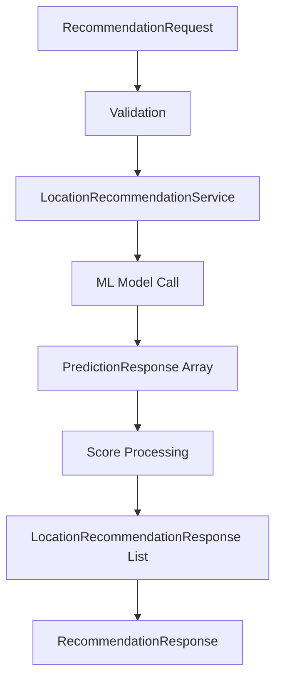
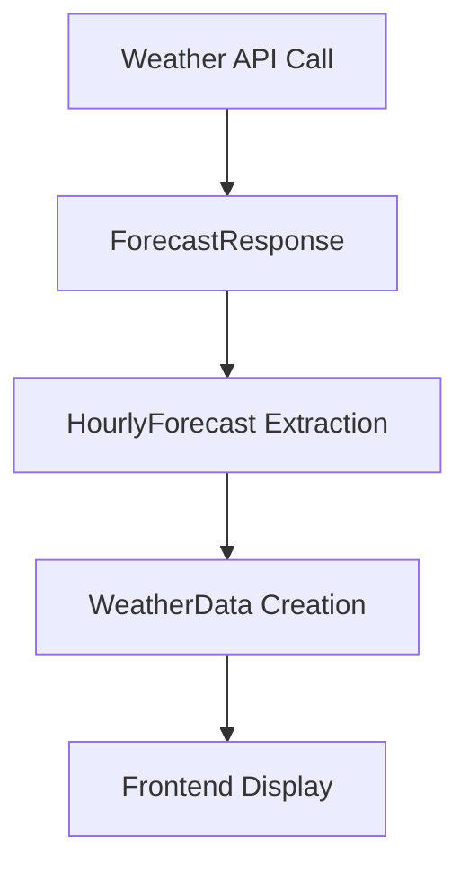
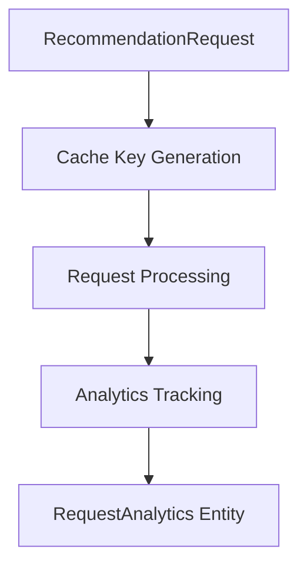

# DTO Package Documentation

## Overview

The `/dto/` package contains Data Transfer Objects (DTOs) that define the structure for API requests and responses in the Creative Space Finder application. These classes handle JSON serialization/deserialization and provide a clean contract between the API and its consumers.

## Package Structure

```
com.creativespacefinder.manhattan.dto/
├── ForecastResponse.java              # OpenWeather API 96-hour forecast mapping
├── LocationRecommendationResponse.java # Individual location recommendation data
├── PredictionResponse.java            # ML model prediction results
├── RecommendationRequest.java         # Recommendation API request structure
├── RecommendationResponse.java        # Main recommendation API response wrapper
└── WeatherData.java                   # Individual weather data point
```

---

## ForecastResponse.java

### Purpose
Maps the complete 96-hour forecast response from the OpenWeather Pro API. This DTO handles the complex nested structure of weather forecast data and provides convenient access methods for frontend consumption.

### Main Structure
```java
@JsonIgnoreProperties(ignoreUnknown = true)
public class ForecastResponse {
    @JsonProperty("list")
    private List<HourlyForecast> hourly;
}
```

**Design Decision:** 
- `@JsonIgnoreProperties(ignoreUnknown = true)` at root level provides lenient parsing
- OpenWeather API may add new fields without breaking existing functionality

### Nested Classes

#### HourlyForecast - Individual Hour Data
```java
public static class HourlyForecast {
    private long dt;                    // Unix timestamp (epoch seconds)
    
    @JsonProperty("main")
    private TempInfo tempInfo;          // Nested temperature data
    
    private List<Weather> weather;      // Weather conditions array
}
```

**Key Methods:**
```java
public String getReadableTime() {
    return Instant.ofEpochSecond(dt)
            .atZone(ZoneId.of("America/New_York"))
            .format(DateTimeFormatter.ofPattern("yyyy-MM-dd HH:mm"));
}

public double getTemp() { 
    return tempInfo != null ? tempInfo.temp : 0; 
}

public String getCondition() { 
    return (weather != null && !weather.isEmpty()) 
        ? weather.get(0).getMain() : "Unknown"; 
}
```

**Timezone Handling:**
- All timestamps converted to `America/New_York` timezone
- Formatted as `"2025-07-25 15:00"` for frontend compatibility
- Handles daylight saving time automatically

#### TempInfo - Temperature Data
```java
@JsonIgnoreProperties(ignoreUnknown = true)
public static class TempInfo {
    public double temp;  // Temperature in configured units (Imperial = Fahrenheit)
}
```

#### Weather - Condition Details
```java
public static class Weather {
    private int id;              // OpenWeather condition ID
    private String main;         // Main condition (Clear, Rain, Clouds, etc.)
    private String description;  // Detailed description ("clear sky", "light rain")
    private String icon;         // Icon identifier for weather display
}
```

### JSON Structure Example
```json
{
  "list": [
    {
      "dt": 1627308000,
      "main": {
        "temp": 75.2
      },
      "weather": [
        {
          "id": 800,
          "main": "Clear",
          "description": "clear sky",
          "icon": "01d"
        }
      ]
    }
  ]
}
```

### Error Handling Strategy
```java
@JsonAnySetter
void putUnknown(String k, Object v) { unknown.put(k, v); }

@JsonIgnore
private final Map<String,Object> unknown = new HashMap<>();
```

**Purpose:**
- Captures unknown fields from OpenWeather API responses
- Prevents parsing failures when API adds new fields
- Enables debugging of API response changes

### Integration Patterns

#### WeatherForecastService Usage
```java
public List<LocalDateTime> getAvailableForecastDateTimes() {
    ForecastResponse forecast = get96HourForecast();
    return forecast.getHourly().stream()
        .map(h -> Instant.ofEpochSecond(h.getDt())
            .atZone(ZoneId.of("America/New_York"))
            .toLocalDateTime())
        .collect(Collectors.toList());
}
```

---

## LocationRecommendationResponse.java

### Purpose
Represents an individual location recommendation with comprehensive scoring data, geographic coordinates, and crowd information. This DTO is the core data structure returned by the recommendation engine.

### Main Structure
```java
public class LocationRecommendationResponse {
    @JsonProperty("id")
    private UUID id;                        // Unique location identifier
    
    @JsonProperty("zoneName")
    private String zoneName;                // Human-readable location name
    
    @JsonProperty("latitude")
    private BigDecimal latitude;            // Precise geographic coordinate
    
    @JsonProperty("longitude") 
    private BigDecimal longitude;           // Precise geographic coordinate
    
    // Scoring System
    @JsonProperty("activityScore")
    private BigDecimal activityScore;       // ML-predicted activity suitability
    
    @JsonProperty("museScore")
    private BigDecimal museScore;           // Composite creativity inspiration score
    
    @JsonProperty("crowdScore")
    private BigDecimal crowdScore;          // Crowd level appropriateness
    
    // Crowd Information
    @JsonProperty("estimatedCrowdNumber")
    private Integer estimatedCrowdNumber;   // Predicted number of people
    
    @JsonProperty("crowdLevel")
    private String crowdLevel;              // "Busy", "Moderate", "Quiet"
    
    @JsonProperty("scoreBreakdown")
    private ScoreBreakdown scoreBreakdown;  // Detailed scoring explanation
}
```

### Scoring System Architecture

#### Score Types and Ranges
- **Activity Score (1.0-10.0):** ML-predicted suitability for specific creative activity
- **Muse Score (1.0-10.0):** Composite score combining crowd preference + activity suitability
- **Crowd Score (1.0-10.0):** Appropriateness of crowd level for the activity

#### Muse Score Calculation
```java
// In LocationRecommendationService
double museValue = (adjustedCrowdScore * 0.7) + (cultScore * 0.3);
museValue = Math.max(1.0, Math.min(10.0, museValue));
```

**Weighting Rationale:**
- **70% Crowd Preference:** Whether location matches activity's crowd preference
- **30% Cultural Activity:** ML-predicted activity suitability
- Ensures muse score reflects both crowd comfort and creative potential

### Crowd Level Classification

#### Classification Logic
```java
private void assignCrowdLevels(List<LocationRecommendationResponse> locations) {
    // Uses 33rd and 67th percentiles of estimated crowd numbers
    if (crowdNumber <= lowerThreshold) {
        location.setCrowdLevel("Quiet");
    } else if (crowdNumber >= upperThreshold) {
        location.setCrowdLevel("Busy");
    } else {
        location.setCrowdLevel("Moderate");
    }
}
```

**Dynamic Thresholding:**
- Relative to current result set, not absolute values
- Ensures meaningful distribution across recommendations
- Adapts to different times of day and activities

### Nested ScoreBreakdown Class

```java
public static class ScoreBreakdown {
    @JsonProperty("activityScore")
    private BigDecimal activityScore;
    
    @JsonProperty("museScore") 
    private BigDecimal museScore;
    
    @JsonProperty("crowdScore")
    private BigDecimal crowdScore;
    
    @JsonProperty("explanation")
    private String explanation;
}
```

**Explanation Values:**
- `"Calculated from ML .pkl file"` - Fresh ML predictions
- `"Calculation already logged in database"` - Cached historical data

### JSON Response Example
```json
{
  "id": "550e8400-e29b-41d4-a716-446655440000",
  "zoneName": "Washington Square Park: 5th Ave between Waverly Pl and 8th St",
  "latitude": 40.7308,
  "longitude": -73.9973,
  "activityScore": 8.5,
  "museScore": 9.2,
  "crowdScore": 7.8,
  "estimatedCrowdNumber": 45,
  "crowdLevel": "Moderate",
  "scoreBreakdown": {
    "activityScore": 8.5,
    "museScore": 9.2,
    "crowdScore": 7.8,
    "explanation": "Calculated from ML .pkl file"
  }
}
```

### Data Type Decisions

#### BigDecimal for Scores
```java
private BigDecimal museScore;
```

**Rationale:**
- Prevents floating-point precision errors
- Consistent decimal representation in JSON
- Financial-grade precision for scoring calculations

#### Integer for Crowd Numbers
```java
private Integer estimatedCrowdNumber;
```

**Design Choice:**
- Nullable to handle missing predictions
- Integer appropriate for person counts
- Clear distinction from decimal scores

---

## PredictionResponse.java

### Purpose
Represents the response structure from the ML model API. This DTO maps the raw machine learning predictions into Java objects for further processing by the recommendation service.

### Structure
```java
public class PredictionResponse {
    @JsonProperty("muse_score")
    private Float museScore;                    // Nullable - ML creativity score
    
    @JsonProperty("estimated_crowd_number")
    private Integer estimatedCrowdNumber;       // Predicted number of people
    
    @JsonProperty("crowd_score")
    private Float crowdScore;                   // ML crowd density score
    
    @JsonProperty("creative_activity_score")
    private Float creativeActivityScore;        // Activity suitability score
}
```

### Field Descriptions

#### museScore (Float, Nullable)
- **Source:** ML model's creativity inspiration prediction
- **Range:** Typically 1.0-10.0, but can be null
- **Usage:** Combined with other scores to calculate final muse score
- **Nullable Design:** ML model may not always provide this score

#### estimatedCrowdNumber (Integer)
- **Source:** ML model's crowd density prediction
- **Range:** 0-200+ people (varies by location and time)
- **Usage:** Used for crowd level classification and display
- **Business Value:** Helps users understand expected foot traffic

#### crowdScore (Float)
- **Source:** ML model's crowd appropriateness score
- **Range:** 1.0-10.0 scale
- **Processing:** Adjusted based on activity crowd preference
- **Key Insight:** Raw score before quiet/busy activity adjustment

#### creativeActivityScore (Float)
- **Source:** ML model's activity-location suitability prediction
- **Range:** 1.0-10.0 scale
- **Usage:** Represents how well location matches specific activity
- **Examples:** Photography spots get higher scores for photo activities

### ML Model Integration

#### Request Payload Structure
```java
// LocationRecommendationService creates this payload
Map<String,Object> mlPayload = Map.of(
    "latitude", 40.7308,
    "longitude", -73.9973,
    "hour", 15,
    "month", 7,
    "day", 25,
    "cultural_activity_prefered", "Portrait photography"
);
```

#### Batch Processing
```java
protected PredictionResponse[] callMLModelBatch(List<Map<String,Object>> bodies) {
    RestTemplate r = new RestTemplate();
    return r.postForObject(mlPredictUrl, bodies, PredictionResponse[].class);
}
```

**Performance Benefits:**
- Single API call for multiple predictions
- Reduces network overhead
- Consistent response timing across all locations

### Score Processing Pipeline

#### Raw to Processed Conversion
```java
// In LocationRecommendationService
double cultScore = p.getCreativeActivityScore();
double crowdScore = p.getCrowdScore();
int originalCrowdNumber = p.getEstimatedCrowdNumber();

// Activity-specific crowd preference adjustment
if (isQuietActivity(activityName)) {
    adjustedCrowdScore = Math.max(0.0, Math.min(10.0, 10.0 - crowdScore));
} else {
    adjustedCrowdScore = Math.max(0.0, Math.min(10.0, crowdScore));
}
```

### JSON Example
```json
{
  "muse_score": 8.5,
  "estimated_crowd_number": 45,
  "crowd_score": 7.2,
  "creative_activity_score": 8.8
}
```

---

## RecommendationRequest.java

### Purpose
Defines the input structure for recommendation API requests. This DTO handles validation and provides a clean interface for clients to request location recommendations.

### Structure
```java
public class RecommendationRequest {
    @NotBlank(message = "Activity is required")
    @JsonProperty("activity")
    private String activity;
    
    @NotNull(message = "DateTime is required")
    @JsonProperty("dateTime")
    private LocalDateTime dateTime;
    
    @JsonProperty("selectedZone")
    private String selectedZone;  // Optional zone filter
}
```

### Validation Rules

#### Activity Validation
```java
@NotBlank(message = "Activity is required")
```
- **Purpose:** Ensures activity name is provided and not empty
- **Error Response:** 400 Bad Request with message "Activity is required"
- **Valid Values:** Must match activities in database (case-sensitive)

#### DateTime Validation
```java
@NotNull(message = "DateTime is required")
```
- **Purpose:** Ensures valid datetime is provided
- **Format:** ISO LocalDateTime (e.g., "2025-07-25T15:00:00")
- **Error Handling:** Invalid formats caught by `GlobalExceptionHandler`

#### Zone Validation
- **Optional Field:** Can be null or empty string
- **Valid Values:** Must match zone keys from `MANHATTAN_ZONES` map
- **Case Sensitivity:** Converted to lowercase for matching

### Request Examples

#### Basic Request
```json
{
  "activity": "Portrait photography",
  "dateTime": "2025-07-25T15:00:00"
}
```

#### Zone-Filtered Request
```json
{
  "activity": "Street photography", 
  "dateTime": "2025-07-25T17:00:00",
  "selectedZone": "soho hudson square"
}
```

#### Invalid Request Examples
```json
// Missing activity
{
  "dateTime": "2025-07-25T15:00:00"
}
// Response: 400 Bad Request - "Activity is required"

// Invalid datetime format
{
  "activity": "Portrait photography",
  "dateTime": "2025-07-25 15:00"
}
// Response: 400 Bad Request - "Invalid date format"
```

### Cache Key Generation
```java
String cacheKey = request.getActivity() + "_" + request.getDateTime().toString() + "_" +
    (request.getSelectedZone() != null ? request.getSelectedZone() : "all");
```

**Examples:**
- `"Portrait photography_2025-07-25T15:00_soho hudson square"`
- `"Street photography_2025-07-25T17:00_all"`

### Constructors

#### Default Constructor
```java
public RecommendationRequest() {}
```
**Usage:** Required for Jackson JSON deserialization

#### Convenience Constructors
```java
public RecommendationRequest(String activity, LocalDateTime dateTime)
public RecommendationRequest(String activity, LocalDateTime dateTime, String selectedZone)
```
**Usage:** Testing and programmatic request creation

---

## RecommendationResponse.java

### Purpose
Main response wrapper for the recommendation API. Contains the list of location recommendations plus metadata about the request and results.

### Structure
```java
public class RecommendationResponse {
    @JsonProperty("locations")
    private List<LocationRecommendationResponse> locations;
    
    @JsonProperty("activity")
    private String activity;
    
    @JsonProperty("requestedDateTime") 
    private String requestedDateTime;
    
    @JsonProperty("totalResults")
    private int totalResults;
}
```

### Field Descriptions

#### locations
- **Type:** `List<LocationRecommendationResponse>`
- **Content:** Up to 10 recommended locations
- **Ordering:** Sorted by muse score (highest first)
- **Distance Filtering:** Locations must be ≥1000m apart (≥100m for zone searches)

#### activity
- **Type:** `String`
- **Purpose:** Echo back the requested activity for frontend validation
- **Example:** `"Portrait photography"`

#### requestedDateTime
- **Type:** `String` (ISO format)
- **Purpose:** Echo back the requested datetime
- **Format:** `"2025-07-25T15:00:00"`
- **Usage:** Frontend can validate request/response matching

#### totalResults
- **Type:** `int`
- **Purpose:** Count of returned locations
- **Auto-calculated:** Set automatically when locations list is updated
- **Typical Range:** 1-10 (filtered for distance and quality)

### JSON Response Example
```json
{
  "locations": [
    {
      "id": "550e8400-e29b-41d4-a716-446655440000",
      "zoneName": "Washington Square Park",
      "latitude": 40.7308,
      "longitude": -73.9973,
      "activityScore": 8.5,
      "museScore": 9.2,
      "crowdScore": 7.8,
      "estimatedCrowdNumber": 45,
      "crowdLevel": "Moderate"
    }
  ],
  "activity": "Portrait photography",
  "requestedDateTime": "2025-07-25T15:00:00",
  "totalResults": 10
}
```

### Auto-Update Mechanism
```java
public void setLocations(List<LocationRecommendationResponse> locations) {
    this.locations = locations;
    this.totalResults = locations != null ? locations.size() : 0;
}
```

**Design Benefit:** Prevents inconsistency between locations list and totalResults count

---

## WeatherData.java

### Purpose
Represents a single weather data point for a specific datetime and location. Used for detailed weather information requests and integration with recommendation data.

### Structure
```java
public class WeatherData {
    @JsonProperty("dateTime")
    private LocalDateTime dateTime;
    
    @JsonProperty("temperature")
    private BigDecimal temperature;
    
    @JsonProperty("condition")
    private String condition;
    
    @JsonProperty("description")
    private String description;
    
    @JsonProperty("formattedDateTime")
    private String formattedDateTime;
}
```

### Field Descriptions

#### dateTime
- **Type:** `LocalDateTime`
- **Purpose:** Exact timestamp for this weather data
- **Timezone:** Converted to America/New_York in service layer
- **Usage:** Matching with recommendation requests

#### temperature
- **Type:** `BigDecimal`
- **Units:** Fahrenheit (Imperial units)
- **Precision:** Decimal precision for accurate display
- **Range:** Typical NYC range -10°F to 100°F

#### condition
- **Type:** `String`
- **Source:** OpenWeather main condition category
- **Examples:** `"Clear"`, `"Clouds"`, `"Rain"`, `"Snow"`
- **Usage:** High-level weather categorization

#### description
- **Type:** `String`
- **Source:** OpenWeather detailed description
- **Examples:** `"clear sky"`, `"light rain"`, `"overcast clouds"`
- **Usage:** Detailed weather information for users

#### formattedDateTime
- **Type:** `String`
- **Format:** `"yyyy-MM-dd HH:mm"`
- **Example:** `"2025-07-25 15:00"`
- **Purpose:** Human-readable timestamp for frontend display

### Integration Patterns

#### Weather-Recommendation Coordination
```java
// Frontend can request both simultaneously
const recommendations = await fetch('/api/recommendations', {
  method: 'POST',
  body: JSON.stringify({
    activity: 'Portrait photography',
    dateTime: '2025-07-25T15:00'
  })
});

const weather = await fetch('/api/forecast?datetime=2025-07-25T15:00');
```

#### Default Weather Fallback
```java
private WeatherData createDefaultWeatherData(LocalDateTime dateTime) {
    return new WeatherData(
        dateTime,
        new BigDecimal("70.0"),  // Comfortable default temperature
        "Clear",                 // Optimistic default condition
        "clear sky",            // User-friendly description
        dateTime.format(DateTimeFormatter.ofPattern("yyyy-MM-dd HH:mm"))
    );
}
```

### JSON Example
```json
{
  "dateTime": "2025-07-25T15:00:00",
  "temperature": 75.2,
  "condition": "Clear",
  "description": "clear sky",
  "formattedDateTime": "2025-07-25 15:00"
}
```

---

## DTO Design Patterns and Best Practices

### JSON Serialization Strategy

#### Field Naming Convention
```java
@JsonProperty("estimatedCrowdNumber")  // camelCase in JSON
private Integer estimatedCrowdNumber;   // camelCase in Java
```

**Consistency:** Both Java and JSON use camelCase for seamless integration

#### Null Handling
```java
@JsonProperty("selectedZone")
private String selectedZone;  // Optional fields can be null
```

**Design Philosophy:** 
- Required fields use validation annotations
- Optional fields allow null values
- Services handle null gracefully

### Validation Integration

#### Jakarta Validation
```java
@Valid @RequestBody RecommendationRequest request
```

**Benefits:**
- Automatic validation before controller method execution
- Consistent error responses via `GlobalExceptionHandler`
- Clear separation of validation logic from business logic

#### Custom Validation Messages
```java
@NotBlank(message = "Activity is required")
@NotNull(message = "DateTime is required")
```

**User Experience:** Clear, actionable error messages for API consumers

### Performance Considerations

#### BigDecimal vs Double
```java
private BigDecimal latitude;   // Precision critical for coordinates
private Float crowdScore;      // ML model uses Float, converted later
```

**Trade-offs:**
- BigDecimal: Precision, consistency, JSON formatting
- Float: Performance, ML model compatibility
- Decision based on usage context

#### Nested Object Strategy
```java
public static class ScoreBreakdown {
    // Nested class reduces separate class files
    // Still provides type safety and structure
}
```

### Error Resilience

#### Graceful Degradation
```java
@JsonIgnoreProperties(ignoreUnknown = true)
```

**Future-Proofing:** API changes don't break existing clients

#### Default Values
```java
public double getTemp() { 
    return tempInfo != null ? tempInfo.temp : 0; 
}
```

**Defensive Programming:** Null checks prevent runtime exceptions

### Frontend Integration Patterns

#### TypeScript Interface Generation
```typescript
interface LocationRecommendationResponse {
  id: string;
  zoneName: string;
  latitude: number;
  longitude: number;
  activityScore: number;
  museScore: number;
  crowdScore: number;
  estimatedCrowdNumber: number;
  crowdLevel: 'Busy' | 'Moderate' | 'Quiet';
}
```

#### Request/Response Validation
```javascript
// Frontend can validate required fields
const isValidRequest = (req) => {
  return req.activity && req.activity.trim() !== '' && 
         req.dateTime && new Date(req.dateTime).getTime() > 0;
};
```

### Testing Strategies

#### DTO Construction for Tests
```java
// Convenience constructors enable easy test data creation
RecommendationRequest request = new RecommendationRequest(
    "Portrait photography", 
    LocalDateTime.of(2025, 7, 25, 15, 0)
);
```

#### JSON Serialization Tests
```java
@Test
public void testJsonSerialization() {
    ObjectMapper mapper = new ObjectMapper();
    RecommendationResponse response = createTestResponse();
    String json = mapper.writeValueAsString(response);
    // Verify JSON structure and field names
}
```

---

## Integration Flows

### Recommendation Flow


### Weather Integration Flow


### Analytics Data Flow


---

## Best Practices Summary

### DTO Design Principles
1. **Single Responsibility:** Each DTO represents one concept clearly
2. **Immutable Where Possible:** Use final fields and defensive copying
3. **Validation at Boundaries:** Validate input DTOs, trust internal DTOs
4. **Consistent Naming:** Use clear, descriptive field names

### Performance Optimization
1. **Appropriate Data Types:** Choose types based on usage patterns
2. **Lazy Loading:** Only include necessary data in responses
3. **Batch Operations:** Use arrays/lists for bulk operations
4. **Caching Friendly:** Design DTOs to work well with cache keys

### Error Handling
1. **Graceful Parsing:** Use `@JsonIgnoreProperties` for API evolution
2. **Null Safety:** Provide defaults and null checks
3. **Clear Validation:** Use descriptive validation messages
4. **Fallback Values:** Provide sensible defaults for missing data

### API Evolution
1. **Backward Compatibility:** Add fields, don't remove or rename
2. **Optional Fields:** Make new fields optional with defaults
3. **Version Considerations:** Plan for future API versions
4. **Documentation:** Keep DTO documentation synchronized with code