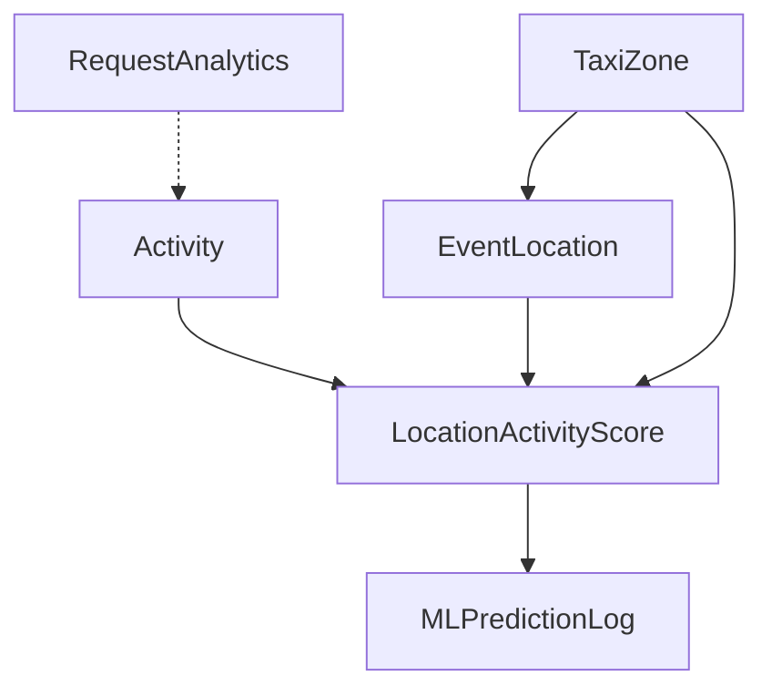

# Entity Package Documentation

## Overview

The `/entity/` package contains JPA entity classes that define the database schema and object-relational mapping for the Creative Space Finder application. These entities represent the core domain objects including activities, locations, scoring data, analytics, and system logs.

## Package Structure

```
com.creativespacefinder.manhattan.entity/
├── Activity.java              # Creative activities (photography, painting, etc.)
├── EventLocation.java         # Specific Manhattan locations with coordinates
├── LocationActivityScore.java # Core scoring data linking locations and activities
├── MLPredictionLog.java       # ML model prediction tracking and metadata
├── RequestAnalytics.java      # API usage analytics and performance metrics
└── TaxiZone.java             # NYC taxi zones for geographic grouping
```

---

## Activity.java

### Purpose
Represents creative activities that users can search for in Manhattan. This is a simple lookup entity that stores the master list of supported activities like "Portrait photography", "Street photography", "Filmmaking", etc.

### Entity Configuration
```java
@Entity
@Table(name = "activities")
public class Activity {
    @Id
    @GeneratedValue(strategy = GenerationType.AUTO)
    @Column(nullable = false, updatable = false)
    private UUID id;

    @Column(name = "name", nullable = false, unique = true, length = 50)
    private String name;
}
```

### Key Constraints

#### Primary Key
- **Type:** `UUID` with auto-generation
- **Immutable:** `updatable = false` prevents accidental ID changes
- **Database Independence:** UUIDs work across different database systems

#### Unique Activity Names
```java
@Column(name = "name", nullable = false, unique = true, length = 50)
```
- **Uniqueness:** Prevents duplicate activity entries
- **Length Limit:** 50 characters maximum for activity names
- **Non-nullable:** Every activity must have a name

### Sample Data
```sql
INSERT INTO activities (id, name) VALUES 
('550e8400-e29b-41d4-a716-446655440000', 'Portrait photography'),
('550e8400-e29b-41d4-a716-446655440001', 'Street photography'),
('550e8400-e29b-41d4-a716-446655440002', 'Landscape painting'),
('550e8400-e29b-41d4-a716-446655440003', 'Filmmaking'),
('550e8400-e29b-41d4-a716-446655440004', 'Portrait painting');
```

### Usage Patterns

#### Repository Integration
```java
// ActivityRepository methods
Optional<Activity> findByNameIgnoreCase(String name);
Optional<Activity> findByName(String name);
boolean existsByNameIgnoreCase(String name);
```

#### Service Layer Usage
```java
// LocationRecommendationService
Activity activity = activityRepository.findByName(activityName)
    .orElseThrow(() -> new RuntimeException("Activity not found: " + activityName));
```

### Business Rules

#### Activity Management
- Activities are relatively static master data
- New activities require careful consideration of ML model training
- Activity names should be descriptive and user-friendly
- Case-sensitive matching in current implementation

#### Relationship Context
- Referenced by `LocationActivityScore` for scoring calculations
- Used in recommendation requests for activity filtering
- Forms the basis for cache key generation

---

## EventLocation.java

### Purpose
Represents specific physical locations in Manhattan where creative activities can take place. Each location has precise GPS coordinates and is associated with the nearest NYC taxi zone for geographic grouping.

### Entity Configuration
```java
@Entity
@Table(name = "event_locations")
public class EventLocation {
    @Id
    @GeneratedValue(strategy = GenerationType.AUTO)
    @Column(name = "id", nullable = false)
    private UUID id;

    @Column(name = "location_name", nullable = false, columnDefinition = "TEXT")
    private String locationName;

    @Column(name = "latitude", nullable = false, precision = 10, scale = 7)
    private BigDecimal latitude;

    @Column(name = "longitude", nullable = false, precision = 10, scale = 7)
    private BigDecimal longitude;

    @ManyToOne(fetch = FetchType.LAZY)
    @JoinColumn(name = "nearest_taxi_zone_id")
    private TaxiZone nearestTaxiZone;
}
```

### Geographic Precision

#### Coordinate Storage
```java
@Column(name = "latitude", nullable = false, precision = 10, scale = 7)
@Column(name = "longitude", nullable = false, precision = 10, scale = 7)
```

**Precision Details:**
- **Total Digits:** 10 (including decimals)
- **Decimal Places:** 7 (sub-meter accuracy)
- **Coverage:** Sufficient for precise Manhattan location mapping
- **Accuracy:** ~11cm precision at NYC latitude

**Example Coordinates:**
- Washington Square Park: `40.7308000, -73.9973000`
- Times Square: `40.7580000, -73.9855000`
- Central Park: `40.7812000, -73.9665000`

### Location Naming Strategy

#### Text Storage
```java
@Column(name = "location_name", nullable = false, columnDefinition = "TEXT")
```

**Design Rationale:**
- `TEXT` type accommodates long, descriptive location names
- Supports detailed street intersections and landmarks
- No length limitations for complex NYC addressing

**Naming Examples:**
```
"Washington Square Park: 5th Ave between Waverly Pl and 8th St"
"Times Square (Herald Square): Broadway between 42nd St and 47th St"
"Central Park: 5th Ave between 59th St and 110th St"
```

### Relationship Mapping

#### Taxi Zone Association
```java
@ManyToOne(fetch = FetchType.LAZY)
@JoinColumn(name = "nearest_taxi_zone_id")
private TaxiZone nearestTaxiZone;
```

**Relationship Benefits:**
- **Geographic Grouping:** Locations grouped by NYC taxi zones
- **Zone Filtering:** Users can filter recommendations by area
- **Performance:** Lazy loading prevents unnecessary taxi zone data fetching
- **Analytics:** Zone-based usage pattern analysis

### Audit Fields
```java
@CreationTimestamp
@Column(name = "created_at", nullable = false, updatable = false)
private LocalDateTime createdAt;

@UpdateTimestamp
@Column(name = "updated_at", nullable = false)
private LocalDateTime updatedAt;
```

**Tracking Capabilities:**
- **Creation Time:** When location was first added to system
- **Update Time:** When location details were last modified
- **Data Integrity:** Helps track data quality and freshness

### Test Support Constructor
```java
public EventLocation(String locationName, double latitude, double longitude) {
    this.locationName = locationName;
    this.latitude = BigDecimal.valueOf(latitude);
    this.longitude = BigDecimal.valueOf(longitude);
    this.nearestTaxiZone = null;
}
```

**Testing Benefits:**
- Simplified test data creation
- No need to manage taxi zone relationships in unit tests
- Easy coordinate specification with primitive doubles

---

## LocationActivityScore.java

### Purpose
The core entity that links locations with activities and stores both historical data and ML predictions. This entity represents the heart of the recommendation system, containing all scoring data used to rank locations for specific activities.

### Entity Configuration
```java
@Entity
@Table(name = "location_activity_scores")
public class LocationActivityScore {
    @Id
    @GeneratedValue(strategy = GenerationType.AUTO)
    @Column(name = "id", nullable = false)
    private UUID id;

    @Column(name = "event_id", nullable = false)
    private Integer eventId;
    
    // Relationship mappings
    @ManyToOne(fetch = FetchType.LAZY)
    @JoinColumn(name = "location_id", nullable = false)
    private EventLocation location;

    @ManyToOne(fetch = FetchType.LAZY)
    @JoinColumn(name = "activity_id", nullable = false)
    private Activity activity;

    @ManyToOne(fetch = FetchType.LAZY)
    @JoinColumn(name = "taxi_zone_id", nullable = false)
    private TaxiZone taxiZone;
}
```

### Temporal Data Structure
```java
@Column(name = "event_date", nullable = false)
private LocalDate eventDate;

@Column(name = "event_time", nullable = false)
private LocalTime eventTime;
```

**Time-based Recommendations:**
- **Date Specificity:** Different scores for different days
- **Time Specificity:** Hourly granularity for crowd patterns
- **Seasonal Patterns:** Supports date-based recommendation variations
- **Cache Keys:** Date/time used in cache key generation

### Historical Score Data
```java
@Column(name = "historical_taxi_zone_crowd_score", precision = 5, scale = 3)
private BigDecimal historicalTaxiZoneCrowdScore;

@Column(name = "historical_activity_score", precision = 5, scale = 2)
private BigDecimal historicalActivityScore;
```

**Historical Data Sources:**
- **Crowd Score:** Based on NYC taxi data and historical foot traffic
- **Activity Score:** Historical analysis of location-activity suitability
- **Fallback Data:** Used when ML predictions unavailable
- **Precision:** 5 total digits with 2-3 decimal places for scoring accuracy

### ML Prediction Fields
```java
@Column(name = "cultural_activity_score", precision = 5, scale = 2)
private BigDecimal culturalActivityScore;

@Column(name = "crowd_score", precision = 5, scale = 2)
private BigDecimal crowdScore;

@Column(name = "muse_score", precision = 5, scale = 2)
private BigDecimal museScore;

@Column(name = "estimated_crowd_number")
private Integer estimatedCrowdNumber;
```

**ML Integration:**
- **Nullable Fields:** ML predictions may not be available for all records
- **Real-time Updates:** Populated by ML model API calls
- **Composite Scoring:** Multiple scores combined for final recommendations
- **Crowd Numbers:** Specific crowd count predictions (0-200+ people)

### Score Calculation Logic

#### Muse Score Calculation
```java
// In LocationRecommendationService
double museValue = (adjustedCrowdScore * 0.7) + (cultScore * 0.3);
museValue = Math.max(1.0, Math.min(10.0, museValue));
```

**Weighting Strategy:**
- **70% Crowd Preference:** How well crowd level matches activity preference
- **30% Cultural Activity:** ML-predicted activity-location suitability
- **Range:** 1.0-10.0 scale for consistent scoring

#### Crowd Score Adjustment
```java
// Quiet activities (portrait photography, filmmaking)
if (isQuietActivity(activityName)) {
    adjustedCrowdScore = Math.max(0.0, Math.min(10.0, 10.0 - crowdScore));
} else {
    // Busy activities (street photography, events)
    adjustedCrowdScore = Math.max(0.0, Math.min(10.0, crowdScore));
}
```

### Metadata and Tracking
```java
@Column(name = "ml_prediction_date")
private LocalDateTime mlPredictionDate;

@CreationTimestamp
@Column(name = "created_at", nullable = false, updatable = false)
private LocalDateTime createdAt;

@UpdateTimestamp
@Column(name = "updated_at", nullable = false)
private LocalDateTime updatedAt;
```

**Data Lifecycle Tracking:**
- **Prediction Timestamp:** When ML scores were last updated
- **Creation/Update Times:** Entity lifecycle tracking
- **Data Freshness:** Helps identify stale predictions

### Helper Methods

#### Data Availability Checks
```java
public boolean hasMLPredictions() {
    return culturalActivityScore != null && crowdScore != null && museScore != null;
}

public boolean hasHistoricalData() {
    return historicalActivityScore != null;
}

public String getRecommendationStatus() {
    if (hasMLPredictions()) {
        return "ml_ready";
    } else if (hasHistoricalData()) {
        return "historical_fallback";
    } else {
        return "no_data";
    }
}
```

**Data Quality Management:**
- Identifies records ready for recommendations
- Supports fallback strategies when ML data unavailable
- Enables data quality reporting and monitoring

---

## MLPredictionLog.java

### Purpose
Tracks machine learning model predictions, including metadata about model versions, prediction accuracy, and processing statistics. This entity provides audit trails and performance monitoring for ML operations.

### Entity Configuration
```java
@Entity
@Table(name = "ml_prediction_logs")
public class MLPredictionLog {
    @Id
    @Column(name = "id", nullable = false)
    private UUID id;  // Manually assigned via UUID.randomUUID()

    @Column(name = "model_version", length = 50)
    private String modelVersion;  // Nullable for legacy entries

    @Column(name = "prediction_type", nullable = false, length = 50)
    private String predictionType;

    @Column(name = "records_processed", nullable = false)
    private Integer recordsProcessed;

    @Column(name = "records_updated", nullable = false)  
    private Integer recordsUpdated;

    @Column(name = "prediction_date", nullable = false)
    private OffsetDateTime predictionDate;
}
```

### Key Design Decisions

#### Manual ID Assignment
```java
@Id
@Column(name = "id", nullable = false)
private UUID id;

// In service code:
MLPredictionLog log = new MLPredictionLog();
log.setId(UUID.randomUUID());
```

**Rationale:**
- Explicit control over ID generation
- Consistent with application UUID strategy
- Prevents auto-generation conflicts

#### Timezone-Aware Timestamps
```java
@Column(name = "prediction_date", nullable = false)
private OffsetDateTime predictionDate;
```

**Benefits:**
- **Timezone Preservation:** Stores timezone information with timestamp
- **Global Deployment:** Supports distributed systems across timezones
- **Audit Accuracy:** Precise timing for compliance and debugging

### Prediction Tracking Fields

#### Model Versioning
```java
@Column(name = "model_version", length = 50)
private String modelVersion;  // e.g., "3.0", "2.1-beta", "prod-v1.5"
```

**Version Management:**
- Track which model version generated predictions
- Support A/B testing and model rollbacks
- Correlate prediction quality with model versions

#### Prediction Types
```java
@Column(name = "prediction_type", nullable = false, length = 50)
private String predictionType;  // e.g., "location_recommendation", "batch_update"
```

**Common Values:**
- `"location_recommendation"` - Real-time recommendation requests
- `"batch_update"` - Scheduled batch processing
- `"cache_warming"` - Daily cache precomputation
- `"model_validation"` - Testing and validation runs

#### Processing Statistics
```java
@Column(name = "records_processed", nullable = false)
private Integer recordsProcessed;

@Column(name = "records_updated", nullable = false)
private Integer recordsUpdated;
```

**Performance Tracking:**
- **Processing Efficiency:** Compare processed vs updated counts
- **Success Rates:** Track prediction success ratios
- **Batch Monitoring:** Monitor large-scale prediction operations

### Optional Quality Metrics
```java
@Column(name = "model_accuracy", precision = 5, scale = 4)
private BigDecimal modelAccuracy;  // e.g., 0.8745 (87.45%)

@Column(name = "notes", columnDefinition = "TEXT")
private String notes;  // Free-form operational notes
```

**Quality Assurance:**
- **Accuracy Tracking:** Monitor model performance over time
- **Operational Notes:** Record deployment issues, data quality problems
- **Performance Analysis:** Correlate accuracy with processing volume

### Usage Patterns

#### Service Integration
```java
// In LocationRecommendationService
MLPredictionLog log = new MLPredictionLog();
log.setId(UUID.randomUUID());
log.setModelVersion("3.0");
log.setPredictionType("location_recommendation");
log.setRecordsProcessed(processed.size());
log.setRecordsUpdated(processed.size());
log.setPredictionDate(OffsetDateTime.now());
mlPredictionLogRepository.save(log);
```

#### Analytics Queries
```sql
-- Model performance over time
SELECT model_version, 
       AVG(model_accuracy) as avg_accuracy,
       COUNT(*) as prediction_runs
FROM ml_prediction_logs 
WHERE prediction_date >= NOW() - INTERVAL '30 days'
GROUP BY model_version;

-- Processing efficiency
SELECT prediction_type,
       AVG(records_updated::float / records_processed) as success_rate
FROM ml_prediction_logs
GROUP BY prediction_type;
```

---

## RequestAnalytics.java

### Purpose
Captures detailed analytics about API usage patterns, cache performance, and user behavior. This entity enables optimization of cache warming strategies and provides insights into application usage trends.

### Entity Configuration
```java
@Entity
@Table(name = "request_analytics")
public class RequestAnalytics {
    @Id
    @GeneratedValue(strategy = GenerationType.AUTO)
    private UUID id;

    @Column(name = "activity_name", nullable = false)
    private String activityName;

    @Column(name = "requested_hour", nullable = false)
    private Integer requestedHour;  // 0-23

    @Column(name = "requested_day_of_week", nullable = false)
    private Integer requestedDayOfWeek;  // 1=Monday, 7=Sunday

    @Column(name = "request_count", nullable = false)
    private Integer requestCount = 1;

    @Column(name = "last_requested", nullable = false)
    private LocalDateTime lastRequested;
}
```

### Temporal Pattern Tracking

#### Hour-based Analytics
```java
@Column(name = "requested_hour", nullable = false)
private Integer requestedHour;  // 0-23 hour format
```

**Usage Insights:**
- **Peak Hours:** Identify busiest API usage times
- **Cache Optimization:** Pre-warm popular hours
- **Resource Planning:** Scale infrastructure for peak times

#### Day-of-Week Patterns
```java
@Column(name = "requested_day_of_week", nullable = false)
private Integer requestedDayOfWeek;  // ISO standard: 1=Monday, 7=Sunday
```

**Pattern Analysis:**
- **Weekend vs Weekday:** Different activity preferences
- **Cache Strategy:** Day-specific pre-warming schedules
- **User Behavior:** Understand when people plan creative activities

### Performance Metrics
```java
@Column(name = "cache_hit", nullable = false)
private Boolean cacheHit = false;

@Column(name = "response_time_ms")
private Long responseTimeMs;

@Column(name = "user_agent")
private String userAgent;
```

**Performance Tracking:**
- **Cache Effectiveness:** Hit/miss rates per activity/time combination
- **Response Times:** Performance monitoring and optimization
- **Device Analytics:** Mobile vs desktop usage patterns

### Aggregate Data Management

#### Request Counting
```java
@Column(name = "request_count", nullable = false)
private Integer requestCount = 1;

public void incrementRequestCount() {
    this.requestCount++;
    this.lastRequested = LocalDateTime.now();
}
```

**Data Efficiency:**
- **Single Record per Pattern:** One row per activity/hour/day combination
- **Incremental Updates:** Avoids creating duplicate records
- **Storage Optimization:** Compact analytics storage

#### Latest Request Tracking
```java
@Column(name = "last_requested", nullable = false)
private LocalDateTime lastRequested;
```

**Recency Analysis:**
- **Active Patterns:** Identify currently popular combinations
- **Trend Analysis:** Track rising/declining activity interest
- **Cache Prioritization:** Focus on recently requested patterns

### Analytics Service Integration

#### Automatic Tracking
```java
// In RecommendationController
analyticsService.trackRequest(
    request.getActivity(),
    request.getDateTime(),
    cacheHit,
    responseTime
);
```

#### Usage Pattern Queries
```java
// Popular combinations for cache optimization
List<RequestAnalytics> findPopularCombinations(@Param("minRequests") Integer minRequests);

// Cache performance analysis
List<Object[]> getCacheHitRateStats();

// Recent activity monitoring
List<RequestAnalytics> findRecentActivity(@Param("since") LocalDateTime since);
```

### Business Intelligence Applications

#### Cache Warming Optimization
```sql
-- Top combinations for pre-warming
SELECT activity_name, requested_hour, requested_day_of_week, request_count
FROM request_analytics 
WHERE request_count >= 5
ORDER BY request_count DESC, last_requested DESC;
```

#### Performance Analysis
```sql
-- Cache hit rates by activity and hour
SELECT activity_name, requested_hour,
       AVG(CASE WHEN cache_hit THEN 1.0 ELSE 0.0 END) as hit_rate,
       AVG(response_time_ms) as avg_response_time
FROM request_analytics
GROUP BY activity_name, requested_hour
ORDER BY hit_rate DESC;
```

---

## TaxiZone.java

### Purpose
Represents NYC taxi zones used for geographic grouping and filtering of locations within Manhattan. This entity provides a way to organize locations into recognizable neighborhoods and areas for user-friendly zone-based filtering.

### Entity Configuration
```java
@Entity
@Table(name = "taxi_zones")
public class TaxiZone {
    @Id
    @GeneratedValue(strategy = GenerationType.AUTO)
    @Column(name = "id", nullable = false)
    private UUID id;

    @Column(name = "zone_name", nullable = false, unique = true, length = 100)
    private String zoneName;

    @Column(name = "latitude", nullable = false, precision = 10, scale = 7)
    private BigDecimal latitude;

    @Column(name = "longitude", nullable = false, precision = 10, scale = 7)
    private BigDecimal longitude;
}
```

### Geographic Structure

#### Zone Naming Convention
```java
@Column(name = "zone_name", nullable = false, unique = true, length = 100)
```

**Sample Zone Names:**
- `"Financial District North"`
- `"SoHo"`
- `"Greenwich Village North"`
- `"Times Sq/Theatre District"`
- `"Central Park"`
- `"Upper East Side South"`

**Naming Strategy:**
- **NYC Official Names:** Based on NYC Taxi & Limousine Commission zones
- **Unique Identifiers:** Each zone name is unique
- **User Recognition:** Names that Manhattan visitors/residents recognize

#### Zone Coordinates
```java
@Column(name = "latitude", nullable = false, precision = 10, scale = 7)
@Column(name = "longitude", nullable = false, precision = 10, scale = 7)
```

**Coordinate Purpose:**
- **Zone Centers:** Representative coordinates for each zone
- **Distance Calculations:** Used for location-to-zone assignment
- **Mapping Integration:** Support for map-based zone visualization

### Zone Grouping Strategy

#### Manhattan Zone Categories
```java
// From LocationRecommendationService.MANHATTAN_ZONES
private static final Map<String, List<String>> MANHATTAN_ZONES = new HashMap<>();
static {
    MANHATTAN_ZONES.put("financial district", Arrays.asList(
        "Financial District North", "Financial District South", 
        "World Trade Center", "Battery Park"));
    
    MANHATTAN_ZONES.put("soho hudson square", Arrays.asList(
        "SoHo", "Hudson Sq", "Little Italy/NoLiTa"));
    
    MANHATTAN_ZONES.put("times square theater district", Arrays.asList(
        "Times Sq/Theatre District", "Garment District"));
}
```

**Grouping Benefits:**
- **User-Friendly Filtering:** Broader area selection for recommendations
- **Geographic Logic:** Logically related neighborhoods grouped together
- **Flexible Granularity:** Both specific zones and area groups available

### Audit Timestamps
```java
@CreationTimestamp
@Column(name = "created_at", nullable = false, updatable = false)
private LocalDateTime createdAt;

@UpdateTimestamp
@Column(name = "updated_at", nullable = false)
private LocalDateTime updatedAt;
```

**Data Management:**
- **Change Tracking:** Monitor zone data modifications
- **Data Quality:** Identify when zones were added or updated
- **System Auditing:** Track data lifecycle for compliance

### Usage in Recommendation Flow

#### Zone-based Filtering
```java
// In LocationRecommendationService
private List<LocationActivityScore> filterByZone(
    List<LocationActivityScore> locations, String selectedZone) {
    
    List<String> zoneNames = MANHATTAN_ZONES.get(selectedZone.toLowerCase());
    return locations.stream()
        .filter(location -> zoneNames.contains(location.getTaxiZone().getZoneName()))
        .collect(Collectors.toList());
}
```

#### Distance Calculations
```java
// Distance-based zone assignment for new locations
private TaxiZone findNearestZone(BigDecimal lat, BigDecimal lon) {
    return taxiZoneRepository.findAll().stream()
        .min(Comparator.comparing(zone -> 
            calculateDistance(lat, lon, zone.getLatitude(), zone.getLongitude())))
        .orElse(null);
}
```

---

## Entity Relationships and Data Flow

### Core Relationship Model


### Entity Interactions

#### Primary Scoring Flow
1. **User Request:** Activity + DateTime + Optional Zone
2. **Entity Resolution:** Activity entity lookup by name
3. **Location Scoring:** LocationActivityScore entities for activity
4. **Zone Filtering:** Filter by TaxiZone if zone specified
5. **ML Enhancement:** Update scores with fresh predictions
6. **Analytics Tracking:** Record request in RequestAnalytics
7. **Audit Logging:** Record ML operation in MLPredictionLog

#### Data Dependencies
- **EventLocation → TaxiZone:** Each location belongs to nearest zone
- **LocationActivityScore → Activity:** Links scores to specific activities
- **LocationActivityScore → EventLocation:** Links scores to specific locations
- **LocationActivityScore → TaxiZone:** Enables zone-based filtering
- **RequestAnalytics → Activity:** Tracks usage by activity name
- **MLPredictionLog:** Independent audit trail for ML operations

### Performance Considerations

#### Query Optimization
```java
// Two-step query for better performance
@Query(value = """
    SELECT las.id FROM location_activity_scores las
    WHERE las.id IN (
        SELECT DISTINCT ON (las2.location_id) las2.id
        FROM location_activity_scores las2
        JOIN activities a ON las2.activity_id = a.id
        WHERE LOWER(a.name) = LOWER(:activityName)
        ORDER BY las2.location_id, las2.historical_activity_score DESC NULLS LAST
    )
    """, nativeQuery = true)
List<String> findDistinctLocationIdsByActivityName(@Param("activityName") String activityName);
```

#### Eager Loading Strategy
```java
@Query("""
    SELECT las FROM LocationActivityScore las
    JOIN FETCH las.location
    JOIN FETCH las.taxiZone
    WHERE las.id IN :ids
    """)
List<LocationActivityScore> findByIdsWithEagerLoading(@Param("ids") List<UUID> ids);
```

**Performance Benefits:**
- **N+1 Prevention:** Eager loading eliminates multiple queries
- **DISTINCT Optimization:** Native SQL for complex distinct operations
- **Connection Management:** Efficient use of database connections

### Data Integrity and Constraints

#### Referential Integrity
- **Foreign Keys:** All entity relationships enforced at database level
- **Cascade Rules:** Deletion handling for dependent entities
- **Null Constraints:** Required fields enforced by database

#### Business Rules
- **Activity Uniqueness:** Prevents duplicate activity names
- **Zone Uniqueness:** Ensures unique taxi zone names
- **Score Ranges:** Application-level validation for score boundaries
- **Temporal Consistency:** Date/time validation for scoring records

### Migration and Evolution

#### Schema Evolution Strategy
```sql
-- Example migration for new ML fields
ALTER TABLE location_activity_scores 
ADD COLUMN estimated_crowd_number INTEGER,
ADD COLUMN ml_prediction_date TIMESTAMP;

-- Index for performance
CREATE INDEX idx_las_activity_score ON location_activity_scores(activity_id, historical_activity_score DESC);
```

#### Backward Compatibility
- **Nullable ML Fields:** Supports gradual ML model deployment
- **Default Values:** Sensible defaults for new optional fields
- **Graceful Degradation:** System works with partial ML coverage

---

## Best Practices and Recommendations

### Entity Design Principles

#### UUID Strategy
- **Global Uniqueness:** UUIDs prevent ID conflicts across environments
- **Database Independence:** Works with PostgreSQL, MySQL, H2, etc.
- **Security:** Non-sequential IDs prevent enumeration attacks
- **Distribution:** Supports distributed systems and data replication

#### BigDecimal for Precision
```java
@Column(name = "latitude", precision = 10, scale = 7)
private BigDecimal latitude;
```
- **Financial Precision:** Exact decimal representation
- **Geographic Accuracy:** Sub-meter precision for coordinates
- **Score Consistency:** Reliable score calculations without floating-point errors

#### Audit Trail Strategy
```java
@CreationTimestamp
@UpdateTimestamp
```
- **Data Lifecycle:** Track when records created/modified
- **Debugging:** Identify timing issues and data freshness
- **Compliance:** Audit requirements for data management

### Performance Optimization

#### Lazy Loading Configuration
```java
@ManyToOne(fetch = FetchType.LAZY)
```
- **Memory Efficiency:** Load related entities only when needed
- **Query Control:** Explicit control over what data is fetched
- **Performance:** Prevents unnecessary data loading

#### Index Strategy
```sql
-- Performance-critical indexes
CREATE INDEX idx_las_activity_id ON location_activity_scores(activity_id);
CREATE INDEX idx_las_location_id ON location_activity_scores(location_id);
CREATE INDEX idx_analytics_activity_hour ON request_analytics(activity_name, requested_hour);
```

### Data Quality Management

#### Validation Rules
- **Required Fields:** Non-null constraints for essential data
- **Unique Constraints:** Prevent duplicate master data
- **Range Validation:** Application-level validation for scores and coordinates
- **Referential Integrity:** Foreign key constraints for data consistency

#### Error Handling
- **Graceful Degradation:** System functions with missing ML predictions
- **Default Values:** Sensible fallbacks for optional fields
- **Null Handling:** Proper null checks in service layer

### Monitoring and Analytics

#### Health Metrics
```java
// From SystemHealthService
Long totalLocationScores = locationActivityScoreRepository.count();
Long mlRecords = locationActivityScoreRepository.countRecordsWithMLPredictions();
double coveragePercentage = (double) mlRecords / totalLocationScores * 100;
```

#### Performance Tracking
- **Query Performance:** Monitor slow queries and optimization opportunities
- **Data Growth:** Track entity count growth over time
- **ML Coverage:** Monitor percentage of records with ML predictions
- **Cache Effectiveness:** Analyze cache hit rates by data patterns