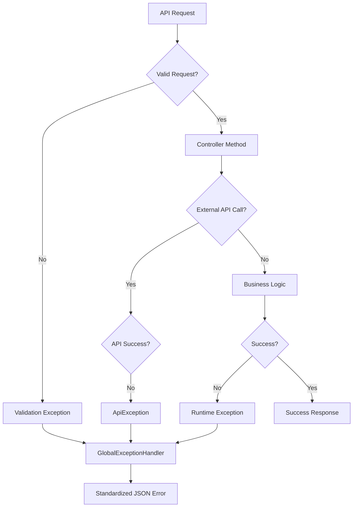

# Exception Package Documentation

## Overview

The `/exception/` package contains custom exception classes and global error handling infrastructure for the Creative Space Finder application. This package ensures consistent error responses, proper HTTP status codes, and comprehensive error handling across all API endpoints.

## Package Structure

```
com.creativespacefinder.manhattan.exception/
├── ApiException.java          # Custom exception for external API failures
└── GlobalExceptionHandler.java # Centralized exception handling with @ControllerAdvice
```

---

## ApiException.java

### Purpose
A custom runtime exception specifically designed for handling failures when communicating with external APIs, particularly the OpenWeather API and ML model services. This exception provides clean JSON error responses when external service integrations fail.

### Class Structure
```java
public class ApiException extends RuntimeException {
    public ApiException(String message) {
        super(message);
    }

    public ApiException(String message, Throwable cause) {
        super(message, cause);
    }
}
```

### Design Rationale

#### RuntimeException Inheritance
```java
public class ApiException extends RuntimeException
```

**Benefits:**
- **Unchecked Exception**: No forced try-catch requirements in calling code
- **Transaction Rollback**: Spring automatically rolls back transactions on RuntimeException
- **Clean API Design**: Service methods don't need throws declarations
- **Consistent Handling**: GlobalExceptionHandler catches and processes uniformly

#### Dual Constructor Pattern
```java
// Message-only constructor
public ApiException(String message) {
    super(message);
}

// Message + cause constructor  
public ApiException(String message, Throwable cause) {
    super(message, cause);
}
```

**Usage Patterns:**
- **Message-only**: Business logic errors with descriptive messages
- **Message + cause**: Wrapping underlying exceptions while preserving stack trace

### Usage Examples

#### OpenWeather API Integration
```java
// In WeatherForecastService
public ForecastResponse get96HourForecast() {
    String url = String.format("%s?lat=%f&lon=%f&appid=%s", BASE_URL, LAT, LON, apiKey);
    try {
        return rest.getForObject(url, ForecastResponse.class);
    } catch (HttpClientErrorException e) {
        throw new ApiException("OpenWeather API call failed: " + e.getStatusCode() 
                + " - " + e.getResponseBodyAsString());
    } catch (Exception e) {
        throw new ApiException("Unexpected error while calling OpenWeather API: " + e.getMessage());
    }
}
```

#### ML Model API Integration
```java
// In LocationRecommendationService
protected PredictionResponse[] callMLModelBatch(List<Map<String,Object>> bodies) {
    try {
        RestTemplate r = new RestTemplate();
        return r.postForObject(mlPredictUrl, bodies, PredictionResponse[].class);
    } catch (HttpClientErrorException e) {
        throw new ApiException("ML Model API failed: " + e.getStatusCode() 
                + " - " + e.getResponseBodyAsString());
    } catch (ResourceAccessException e) {
        throw new ApiException("ML Model API unreachable: " + e.getMessage(), e);
    }
}
```

#### Health Check Integration
```java
// In SystemHealthService
private Map<String, Object> getMLModelHealth() {
    try {
        var response = restTemplate.postForObject(mlPredictUrl, testPayload, Object[].class);
        ml.put("status", "CONNECTED");
    } catch (Exception e) {
        throw new ApiException("ML Model health check failed: " + e.getMessage(), e);
    }
}
```

### Error Message Guidelines

#### Descriptive Error Messages
```java
// Good: Specific, actionable error messages
throw new ApiException("OpenWeather API returned 401 Unauthorized - check API key configuration");
throw new ApiException("ML Model timeout after 30 seconds - service may be overloaded");

// Avoid: Generic or unhelpful messages
throw new ApiException("Error occurred");
throw new ApiException("API failed");
```

#### Security Considerations
```java
// Good: Safe error messages that don't leak sensitive information
throw new ApiException("External service authentication failed");

// Avoid: Messages that expose internal details
throw new ApiException("API key 'sk-abc123...' is invalid");
```

### Integration with Monitoring

#### Logging Integration
```java
// Service layer logging before throwing
System.err.println("OpenWeather API failure: " + e.getMessage());
throw new ApiException("Weather service temporarily unavailable");
```

#### Health Check Responses
```java
// Health checks catch ApiException and report service status
try {
    callExternalService();
    return Map.of("status", "CONNECTED");
} catch (ApiException e) {
    return Map.of("status", "DISCONNECTED", "error", e.getMessage());
}
```

---

## GlobalExceptionHandler.java

### Purpose
Centralized exception handling using Spring's `@ControllerAdvice` to provide consistent error responses across all API endpoints. This handler converts various exception types into appropriate HTTP status codes and standardized JSON error responses.

### Class Configuration
```java
@ControllerAdvice
public class GlobalExceptionHandler {
    
    static class ErrorResponse {
        public String error;
        public String message;
        
        public ErrorResponse(String error, String message) {
            this.error = error;
            this.message = message;
        }
    }
}
```

### Exception Handling Methods

#### Custom API Exceptions
```java
@ExceptionHandler(ApiException.class)
public ResponseEntity<?> handleApiException(ApiException ex) {
    return ResponseEntity
            .status(HttpStatus.BAD_GATEWAY)
            .body(new ErrorResponse("API_ERROR", ex.getMessage()));
}
```

**Response Example:**
```json
{
  "error": "API_ERROR",
  "message": "OpenWeather API call failed: 503 Service Unavailable"
}
```

**HTTP Status: 502 Bad Gateway**
- **Rationale**: External service failure, not client or server application error
- **Semantic Meaning**: Indicates gateway/proxy issue with upstream service
- **Client Guidance**: Suggests retry or service degradation

#### Validation Errors
```java
@ExceptionHandler(MethodArgumentNotValidException.class)
public ResponseEntity<?> handleValidationException(MethodArgumentNotValidException ex) {
    String message = ex.getBindingResult().getFieldError().getDefaultMessage();
    return ResponseEntity
            .status(HttpStatus.BAD_REQUEST)
            .body(new ErrorResponse("VALIDATION_ERROR", message));
}
```

**Response Example:**
```json
{
  "error": "VALIDATION_ERROR", 
  "message": "Activity is required"
}
```

**Validation Sources:**
- `@NotBlank` annotations on DTO fields
- `@NotNull` constraints
- `@Valid` parameter validation
- Custom validation logic

#### JSON Parsing Errors
```java
@ExceptionHandler(HttpMessageNotReadableException.class)
public ResponseEntity<?> handleHttpMessageNotReadableException(HttpMessageNotReadableException ex) {
    return ResponseEntity
            .status(HttpStatus.BAD_REQUEST)
            .body(new ErrorResponse("BAD_REQUEST", "Invalid request format: " + ex.getMessage()));
}
```

**Common Causes:**
- Malformed JSON in request body
- Invalid date format (e.g., "2025-07-25 15:00" instead of "2025-07-25T15:00:00")
- Missing required JSON fields
- Type conversion errors

#### HTTP Method Errors
```java
@ExceptionHandler(HttpRequestMethodNotSupportedException.class)
public ResponseEntity<?> handleMethodNotSupportedException(HttpRequestMethodNotSupportedException ex) {
    return ResponseEntity
            .status(HttpStatus.METHOD_NOT_ALLOWED)
            .body(new ErrorResponse("METHOD_NOT_ALLOWED", ex.getMessage()));
}
```

**Common Scenarios:**
- GET request to POST-only endpoint (`/api/recommendations`)
- POST request to GET-only endpoint (`/api/health`)
- Missing HTTP method configuration

#### Content-Type Errors
```java
@ExceptionHandler(HttpMediaTypeNotSupportedException.class)
public ResponseEntity<?> handleMediaTypeNotSupportedException(HttpMediaTypeNotSupportedException ex) {
    return ResponseEntity
            .status(HttpStatus.UNSUPPORTED_MEDIA_TYPE)
            .body(new ErrorResponse("UNSUPPORTED_MEDIA_TYPE", ex.getMessage()));
}
```

**Common Issues:**
- Missing `Content-Type: application/json` header
- Incorrect media type for JSON endpoints
- File upload attempts on JSON-only endpoints

#### 404 Not Found
```java
@ExceptionHandler(NoHandlerFoundException.class)
public ResponseEntity<?> handleNoHandlerFoundException(NoHandlerFoundException ex) {
    return ResponseEntity
            .status(HttpStatus.NOT_FOUND)
            .body(new ErrorResponse("NOT_FOUND", "Endpoint not found: " + ex.getMessage()));
}
```

**URL Patterns:**
- Typos in endpoint URLs (`/api/recomendations` instead of `/api/recommendations`)
- Non-existent endpoints
- Incorrect path parameters

#### Date/Time Parsing Errors
```java
@ExceptionHandler(DateTimeParseException.class)
public ResponseEntity<?> handleDateTimeParseException(DateTimeParseException ex) {
    return ResponseEntity
            .status(HttpStatus.BAD_REQUEST)
            .body(new ErrorResponse("INVALID_DATETIME", "Invalid date format: " + ex.getMessage()));
}
```

**Valid DateTime Formats:**
```json
// Correct ISO LocalDateTime format
"dateTime": "2025-07-25T15:00:00"

// Invalid formats that trigger this error
"dateTime": "2025-07-25 15:00"
"dateTime": "2025/07/25 3:00 PM"
"dateTime": "July 25, 2025 at 3:00 PM"
```

#### Catch-All Exception Handler
```java
@ExceptionHandler(Exception.class)
public ResponseEntity<?> handleGeneric(Exception ex) {
    return ResponseEntity
            .status(HttpStatus.INTERNAL_SERVER_ERROR)
            .body(new ErrorResponse("INTERNAL_ERROR", ex.getMessage()));
}
```

**Purpose:**
- **Safety Net**: Catches any unhandled exceptions
- **Consistent Format**: Ensures all errors return standard JSON format
- **Debugging Aid**: Provides error messages for unexpected issues
- **Graceful Degradation**: Prevents 500 errors with generic HTML responses

### Error Response Format

#### Standardized JSON Structure
```java
static class ErrorResponse {
    public String error;    // Error category/type
    public String message;  // Human-readable description
}
```

**Design Benefits:**
- **Consistent Structure**: All errors follow same JSON format
- **Machine Readable**: `error` field enables programmatic error handling
- **Human Readable**: `message` field provides clear descriptions
- **Frontend Integration**: Easy to parse and display to users

#### Error Categories
| Error Code | HTTP Status | Description |
|------------|-------------|-------------|
| `API_ERROR` | 502 Bad Gateway | External service failure |
| `VALIDATION_ERROR` | 400 Bad Request | Input validation failure |
| `BAD_REQUEST` | 400 Bad Request | Malformed request |
| `METHOD_NOT_ALLOWED` | 405 Method Not Allowed | Wrong HTTP method |
| `UNSUPPORTED_MEDIA_TYPE` | 415 Unsupported Media Type | Wrong Content-Type |
| `NOT_FOUND` | 404 Not Found | Endpoint doesn't exist |
| `INVALID_DATETIME` | 400 Bad Request | Date/time format error |
| `INTERNAL_ERROR` | 500 Internal Server Error | Unexpected server error |

### Frontend Integration Patterns

#### Error Handling in JavaScript
```javascript
async function getRecommendations(request) {
    try {
        const response = await fetch('/api/recommendations', {
            method: 'POST',
            headers: { 'Content-Type': 'application/json' },
            body: JSON.stringify(request)
        });
        
        if (!response.ok) {
            const error = await response.json();
            switch (error.error) {
                case 'VALIDATION_ERROR':
                    showValidationError(error.message);
                    break;
                case 'API_ERROR':
                    showServiceUnavailableMessage();
                    break;
                default:
                    showGenericError(error.message);
            }
            return null;
        }
        
        return await response.json();
    } catch (networkError) {
        showNetworkError();
        return null;
    }
}
```

#### React Error Handling
```javascript
const [error, setError] = useState(null);

const handleApiError = (errorResponse) => {
    switch (errorResponse.error) {
        case 'VALIDATION_ERROR':
            setError({ type: 'validation', message: errorResponse.message });
            break;
        case 'API_ERROR':
            setError({ type: 'service', message: 'Weather service temporarily unavailable' });
            break;
        default:
            setError({ type: 'generic', message: errorResponse.message });
    }
};
```

### Security Considerations

#### Information Disclosure Prevention
```java
// Good: Generic error messages for security
return new ErrorResponse("INTERNAL_ERROR", "An unexpected error occurred");

// Avoid: Detailed stack traces or internal information
return new ErrorResponse("INTERNAL_ERROR", ex.getStackTrace().toString());
```

#### Error Message Sanitization
```java
// Service layer should sanitize sensitive information before throwing
String sanitizedMessage = ex.getMessage().replaceAll("password=\\w+", "password=***");
throw new ApiException("Authentication failed: " + sanitizedMessage);
```

#### Rate Limiting Considerations
```java
// Future enhancement: Rate limiting for error responses
@ExceptionHandler(TooManyRequestsException.class)
public ResponseEntity<?> handleRateLimit(TooManyRequestsException ex) {
    return ResponseEntity
            .status(HttpStatus.TOO_MANY_REQUESTS)
            .header("Retry-After", "60")
            .body(new ErrorResponse("RATE_LIMITED", "Too many requests"));
}
```

### Logging Integration

#### Error Logging Strategy
```java
@ExceptionHandler(Exception.class)
public ResponseEntity<?> handleGeneric(Exception ex) {
    // Log full exception details for debugging
    System.err.println("Unhandled exception: " + ex.getClass().getSimpleName());
    ex.printStackTrace();
    
    // Return sanitized response to client
    return ResponseEntity
            .status(HttpStatus.INTERNAL_SERVER_ERROR)
            .body(new ErrorResponse("INTERNAL_ERROR", "An unexpected error occurred"));
}
```

#### Structured Logging
```java
// Enhanced logging with structured data
@ExceptionHandler(ApiException.class) 
public ResponseEntity<?> handleApiException(ApiException ex) {
    Map<String, Object> logData = Map.of(
        "errorType", "API_ERROR",
        "message", ex.getMessage(),
        "timestamp", System.currentTimeMillis(),
        "cause", ex.getCause() != null ? ex.getCause().getClass().getSimpleName() : "none"
    );
    
    // Log structured data for monitoring systems
    System.err.println("API Error: " + logData);
    
    return ResponseEntity
            .status(HttpStatus.BAD_GATEWAY)
            .body(new ErrorResponse("API_ERROR", ex.getMessage()));
}
```

### Testing Exception Handling

#### Unit Testing Exception Handlers
```java
@Test
public void testApiExceptionHandling() {
    GlobalExceptionHandler handler = new GlobalExceptionHandler();
    ApiException exception = new ApiException("Test API failure");
    
    ResponseEntity<?> response = handler.handleApiException(exception);
    
    assertEquals(HttpStatus.BAD_GATEWAY, response.getStatusCode());
    
    ErrorResponse body = (ErrorResponse) response.getBody();
    assertEquals("API_ERROR", body.error);
    assertEquals("Test API failure", body.message);
}
```

#### Integration Testing
```java
@Test
public void testValidationErrorResponse() throws Exception {
    mockMvc.perform(post("/api/recommendations")
            .contentType(MediaType.APPLICATION_JSON)
            .content("{}"))  // Missing required fields
            .andExpect(status().isBadRequest())
            .andExpect(jsonPath("$.error").value("VALIDATION_ERROR"))
            .andExpect(jsonPath("$.message").exists());
}
```

---

## Exception Handling Architecture

### Error Flow Diagram


### Exception Hierarchy
```
RuntimeException
├── ApiException (Custom)
│   ├── Weather API failures
│   ├── ML Model API failures
│   └── Health check failures
├── MethodArgumentNotValidException (Spring)
│   ├── @NotBlank violations
│   ├── @NotNull violations
│   └── @Valid failures
├── HttpMessageNotReadableException (Spring)
│   ├── JSON parsing errors
│   ├── DateTime format errors
│   └── Type conversion errors
└── Other Spring/Java exceptions
    ├── HttpRequestMethodNotSupportedException
    ├── NoHandlerFoundException
    └── DateTimeParseException
```

### Best Practices Summary

#### Exception Design
1. **Custom Exceptions**: Create specific exception types for domain-specific errors
2. **RuntimeException**: Use unchecked exceptions for cleaner API design
3. **Message Quality**: Provide clear, actionable error messages
4. **Cause Preservation**: Include original exception as cause when wrapping

#### Global Handler Design
1. **Specific Handlers**: Handle specific exception types before generic catch-all
2. **Consistent Format**: Use standardized error response structure
3. **Appropriate Status Codes**: Return semantically correct HTTP status codes
4. **Security**: Avoid exposing sensitive information in error messages

#### Client Integration
1. **Error Categories**: Use error codes for programmatic error handling
2. **Human Messages**: Provide user-friendly error descriptions
3. **Recovery Guidance**: Include hints for error resolution when possible
4. **Consistent Format**: Maintain same JSON structure across all errors

#### Monitoring and Logging
1. **Structured Logging**: Log errors in machine-readable format
2. **Error Tracking**: Monitor error rates and patterns
3. **Alert Thresholds**: Set up alerts for high error rates
4. **Debug Information**: Include relevant context for troubleshooting