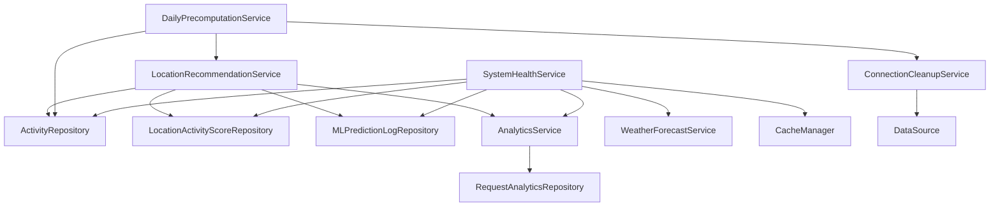

# Service Package Documentation

## Overview

The `/service/` package contains the core business logic services for the Creative Space Finder application. These services handle recommendation processing, analytics tracking, system health monitoring, weather integration, cache management, and database connection optimization.

## Package Structure

```
com.creativespacefinder.manhattan.service/
├── AnalyticsService.java            # API usage analytics and performance tracking
├── ConnectionCleanupService.java     # Database connection pool management
├── DailyPrecomputationService.java   # Cache warming and precomputation orchestration
├── LocationRecommendationService.java # Core recommendation engine with ML integration
├── SystemHealthService.java          # Comprehensive system health monitoring
└── WeatherForecastService.java       # Weather API integration and data processing
```

---

## AnalyticsService.java

### Purpose
Provides comprehensive analytics tracking for API usage patterns, cache performance, and user behavior. This service enables data-driven optimization of cache warming strategies and provides insights into application performance and usage trends.

### Service Configuration
```java
@Service
public class AnalyticsService {
    @Autowired
    private RequestAnalyticsRepository analyticsRepository;
}
```

### Core Analytics Tracking

#### Request Tracking with Cache Detection
```java
public void trackRequest(String activityName, LocalDateTime requestedDateTime,
                         boolean cacheHit, long responseTimeMs) {
    try {
        Integer hour = requestedDateTime.getHour();
        Integer dayOfWeek = requestedDateTime.getDayOfWeek().getValue(); // 1=Monday, 7=Sunday
        String userAgent = getUserAgent();

        Optional<RequestAnalytics> existing = analyticsRepository
                .findByActivityNameAndRequestedHourAndRequestedDayOfWeek(activityName, hour, dayOfWeek);

        if (existing.isPresent()) {
            // Update existing record
            RequestAnalytics analytics = existing.get();
            analytics.incrementRequestCount();
            analytics.setCacheHit(cacheHit);
            analytics.setResponseTimeMs(responseTimeMs);
            if (userAgent != null) {
                analytics.setUserAgent(userAgent);
            }
            analyticsRepository.save(analytics);
        } else {
            // Create new record
            RequestAnalytics analytics = new RequestAnalytics(
                    activityName, hour, dayOfWeek, cacheHit, responseTimeMs, userAgent);
            analyticsRepository.save(analytics);
        }
    } catch (Exception e) {
        // Don't let analytics tracking break the main flow
        System.err.println("Error tracking request analytics: " + e.getMessage());
    }
}
```

**Key Features:**
- **Upsert Pattern:** Updates existing records or creates new ones
- **Temporal Granularity:** Tracks hour-of-day and day-of-week patterns
- **Performance Metrics:** Cache hit/miss rates and response times
- **Error Resilience:** Analytics failures don't break main application flow
- **Device Intelligence:** User agent tracking for mobile vs desktop insights

#### User Agent Extraction
```java
private String getUserAgent() {
    try {
        ServletRequestAttributes attrs = (ServletRequestAttributes) RequestContextHolder.getRequestAttributes();
        if (attrs != null) {
            HttpServletRequest request = attrs.getRequest();
            return request.getHeader("User-Agent");
        }
    } catch (Exception e) {
        // Ignore if not in request context
    }
    return null;
}
```

**Context-Aware Design:**
- **Request Context Integration:** Extracts user agent from current HTTP request
- **Safe Extraction:** Handles cases where request context isn't available
- **Device Analytics:** Enables mobile vs desktop usage analysis

### Analytics Query Methods

#### Popular Combinations for Cache Optimization
```java
public List<RequestAnalytics> getPopularCombinations() {
    return analyticsRepository.findPopularCombinations(3);
}

public List<RequestAnalytics> getPopularCombinationsForActivity(String activityName) {
    return analyticsRepository.findPopularCombinationsForActivity(activityName);
}
```

**Usage in Cache Strategy:**
```java
// In DailyPrecomputationService
List<RequestAnalytics> popular = analyticsService.getPopularCombinations();
for (RequestAnalytics pattern : popular) {
    // Pre-warm cache for popular activity/time combinations
    preWarmCombination(pattern.getActivityName(), pattern.getRequestedHour());
}
```

#### Performance Analytics
```java
public List<Object[]> getCachePerformanceStats() {
    return analyticsRepository.getCacheHitRateStats();
}

public List<Object[]> getActivityTrends() {
    return analyticsRepository.getActivityPopularityStats();
}

public List<Object[]> getHourlyUsagePatterns() {
    return analyticsRepository.getHourlyUsageStats();
}
```

**Business Intelligence Applications:**
- **Cache Effectiveness:** Identify combinations with low hit rates
- **Resource Planning:** Understand peak usage hours
- **Content Strategy:** Focus on popular activities
- **Performance Monitoring:** Track response time trends

#### Recent Activity Monitoring
```java
public List<RequestAnalytics> getRecentActivity() {
    return analyticsRepository.findRecentActivity(LocalDateTime.now().minusDays(7));
}
```

**Operational Insights:**
- **Trend Detection:** Identify emerging usage patterns
- **Real-time Monitoring:** Recent system activity
- **Anomaly Detection:** Unusual request patterns

### Integration with Controllers
```java
// In RecommendationController
try {
    analyticsService.trackRequest(
            request.getActivity(),
            request.getDateTime(),
            cacheHit,
            responseTime
    );
} catch (Exception e) {
    System.err.println("Analytics tracking failed: " + e.getMessage());
    // Don't fail the request if analytics fail
}
```

---

## ConnectionCleanupService.java

### Purpose
Manages database connection pool health specifically for Supabase integration. This service prevents connection leaks, monitors pool usage, and implements aggressive cleanup strategies to work within Supabase's connection limits.

### Service Configuration
```java
@Service
public class ConnectionCleanupService {
    @Autowired
    private DataSource dataSource;
}
```

### Scheduled Connection Monitoring

#### Periodic Connection Health Check
```java
@Scheduled(fixedRate = 30000)
public void monitorAndCleanConnections() {
    try {
        if (dataSource instanceof HikariDataSource) {
            HikariDataSource hikariDS = (HikariDataSource) dataSource;
            HikariPoolMXBean poolBean = hikariDS.getHikariPoolMXBean();

            int active = poolBean.getActiveConnections();
            int idle = poolBean.getIdleConnections();
            int total = poolBean.getTotalConnections();

            // Log connection status
            System.out.println("Connection Monitor - Active: " + active + ", Idle: " + idle + ", Total: " + total);

            // Force cleanup if we have any idle connections
            if (idle > 0) {
                System.out.println("Forcing cleanup of " + idle + " idle connections");
                poolBean.softEvictConnections();
            }

            // Alert if we're using too many connections
            if (total > 1) {
                System.out.println("WARNING: Using " + total + " connections (should be 1 max)");
            }
        }
    } catch (Exception e) {
        System.err.println("Error monitoring connections: " + e.getMessage());
    }
}
```

**Monitoring Strategy:**
- **30-Second Intervals:** Frequent monitoring for early issue detection
- **Aggressive Cleanup:** Force eviction of any idle connections
- **Warning Thresholds:** Alert when connection count exceeds expectations
- **Supabase Optimization:** Tailored for Supabase's connection model

### Application Shutdown Cleanup

#### Graceful Shutdown Handler
```java
@PreDestroy
public void forceCleanupOnShutdown() {
    System.out.println("Application shutting down - forcing connection cleanup");
    try {
        if (dataSource instanceof HikariDataSource) {
            HikariDataSource hikariDS = (HikariDataSource) dataSource;

            // Force close all connections
            hikariDS.getHikariPoolMXBean().softEvictConnections();

            // Wait a moment for cleanup
            Thread.sleep(2000);

            // Close the pool completely
            hikariDS.close();

            System.out.println("Connection cleanup completed");
        }
    } catch (Exception e) {
        System.err.println("Error during shutdown cleanup: " + e.getMessage());
    }
}
```

**Graceful Shutdown Features:**
- **Force Connection Closure:** Ensures all connections are released
- **Cleanup Delay:** Allows time for graceful connection termination
- **Pool Closure:** Complete connection pool shutdown
- **Error Handling:** Logs cleanup issues without blocking shutdown

### Integration with Long-Running Operations

#### Manual Cleanup for Cache Warming
```java
// In DailyPrecomputationService
private void forceConnectionCleanup() {
    try {
        if (dataSource instanceof HikariDataSource) {
            HikariDataSource hikariDS = (HikariDataSource) dataSource;
            hikariDS.getHikariPoolMXBean().softEvictConnections();
        }
    } catch (Exception e) {
        System.err.println("Error during connection cleanup: " + e.getMessage());
    }
}

// Usage in cache warming process
for (Activity activity : activities) {
    // Process recommendation...
    
    // AGGRESSIVE connection management
    forceConnectionCleanup();
    Thread.sleep(2000); // 2 second break after each request
    
    if (totalProcessed % 3 == 0) {
        // Extra cleanup every 3 requests
        forceConnectionCleanup();
        Thread.sleep(5000);
    }
}
```

---

## DailyPrecomputationService.java

### Purpose
Orchestrates the daily cache warming process, managing both scheduled automatic cache warming at 3 AM and on-demand async cache warming triggered by administrators. This service implements sophisticated connection management and performance monitoring.

### Service Configuration
```java
@Service
public class DailyPrecomputationService {
    @Autowired
    private ActivityRepository activityRepository;

    @Autowired
    private LocationRecommendationService locationRecommendationService;

    @Autowired
    private DataSource dataSource;
}
```

### Scheduled Cache Warming

#### Daily 3 AM Cache Warming
```java
@Scheduled(cron = "0 0 3 * * *")
public void dailyPrecomputation() {
    System.out.println("Starting daily pre-computation at 3 AM with connection monitoring...");

    // Monitor connections before starting
    logConnectionStats("BEFORE pre-computation");

    List<Activity> activities = activityRepository.findAll();
    List<LocalTime> reasonableTimes = List.of(
            LocalTime.of(17, 0),   // 5 PM
            LocalTime.of(13, 0),  // 1 PM
            LocalTime.of(12, 0),  // 12 PM
            LocalTime.of(14, 0),  // 2 PM
            LocalTime.of(16, 0),  // 4 PM
            LocalTime.of(18, 0),  // 6 PM
            LocalTime.of(15, 0)   // 3 PM
    );

    int totalProcessed = 0;
    int batchCount = 0;

    try {
        // Process all 4 days
        for (int dayOffset = 0; dayOffset < 4; dayOffset++) {
            LocalDateTime baseDate = LocalDateTime.now().plusDays(dayOffset);

            for (Activity activity : activities) {
                for (LocalTime time : reasonableTimes) {
                    try {
                        LocalDateTime targetDateTime = baseDate.toLocalDate().atTime(time);

                        // Only pre-compute future times
                        if (targetDateTime.isAfter(LocalDateTime.now())) {
                            RecommendationRequest request = new RecommendationRequest(
                                    activity.getName(),
                                    targetDateTime
                            );

                            // Cache the result
                            locationRecommendationService.getLocationRecommendations(request);
                            totalProcessed++;

                            // AGGRESSIVE connection management
                            forceConnectionCleanup();
                            Thread.sleep(2000); // 2 second break after each request

                            // Every 3 requests, take a longer break and force cleanup
                            if (totalProcessed % 3 == 0) {
                                batchCount++;
                                System.out.println("Completed batch " + batchCount + " (processed " + totalProcessed + " combinations)");

                                // Force cleanup and longer break
                                forceConnectionCleanup();
                                Thread.sleep(5000); // 5 second break every 3 requests

                                // Monitor connection status
                                logConnectionStats("After batch " + batchCount);
                            }
                        }
                    } catch (Exception e) {
                        System.err.println("Error pre-computing for " + activity.getName() +
                                " at " + time + ": " + e.getMessage());

                        // Force cleanup on error
                        forceConnectionCleanup();
                        try {
                            Thread.sleep(3000); // Extra break on error
                        } catch (InterruptedException ex) {
                            throw new RuntimeException(ex);
                        }
                    }
                }
            }
        }
    } finally {
        // CRITICAL: Force cleanup after completion
        forceConnectionCleanup();
        logConnectionStats("AFTER pre-computation");
    }

    System.out.println("Daily pre-computation completed at " + LocalDateTime.now());
    System.out.println("Total processed: " + totalProcessed + " combinations");
    System.out.println("Next pre-computation scheduled for 3 AM tomorrow");
}
```

**Cache Warming Strategy:**
- **4-Day Horizon:** Pre-computes recommendations for next 4 days
- **Peak Hours Focus:** Concentrates on popular times (12 PM - 6 PM)
- **Future-Only Processing:** Skips past datetimes
- **Aggressive Connection Management:** Prevents Supabase connection exhaustion

### Async Cache Warming

#### Admin-Triggered Background Processing
```java
@Async("cacheWarmingExecutor")
public CompletableFuture<String> triggerAsyncDailyPrecomputation() {
    try {
        System.out.println("ASYNC Cache Warming Started in Background Thread: " + Thread.currentThread().getName());
        long startTime = System.currentTimeMillis();

        // Call your existing synchronous cache warming method
        dailyPrecomputation();

        long durationMs = System.currentTimeMillis() - startTime;
        long durationMinutes = durationMs / (1000 * 60);

        String successMessage = String.format("ASYNC Cache warming completed successfully! Duration: %d minutes (%d ms)",
                durationMinutes, durationMs);
        System.out.println(successMessage);

        return CompletableFuture.completedFuture(successMessage);

    } catch (Exception e) {
        String errorMessage = "ASYNC Cache warming failed: " + e.getMessage();
        System.err.println(errorMessage);
        e.printStackTrace();

        // Don't throw exception - just return the error in the CompletableFuture
        return CompletableFuture.completedFuture(errorMessage);
    }
}
```

**Async Design Benefits:**
- **Non-blocking:** Admin can trigger cache warming without waiting
- **Background Processing:** Uses dedicated thread pool from AsyncConfig
- **Error Handling:** Graceful error handling without exceptions
- **Performance Tracking:** Duration monitoring and logging

### Connection Management

#### Connection Statistics Logging
```java
private void logConnectionStats(String phase) {
    try {
        if (dataSource instanceof HikariDataSource) {
            HikariDataSource hikariDS = (HikariDataSource) dataSource;
            var poolBean = hikariDS.getHikariPoolMXBean();

            System.out.println("=== CONNECTIONS " + phase + " ===");
            System.out.println("Active: " + poolBean.getActiveConnections());
            System.out.println("Idle: " + poolBean.getIdleConnections());
            System.out.println("Total: " + poolBean.getTotalConnections());
            System.out.println("==============================");
        }
    } catch (Exception e) {
        System.err.println("Error logging connection stats: " + e.getMessage());
    }
}
```

#### Manual Cleanup Integration
```java
private void forceConnectionCleanup() {
    try {
        if (dataSource instanceof HikariDataSource) {
            HikariDataSource hikariDS = (HikariDataSource) dataSource;
            hikariDS.getHikariPoolMXBean().softEvictConnections();
        }
    } catch (Exception e) {
        System.err.println("Error during connection cleanup: " + e.getMessage());
    }
}
```

### Performance Characteristics

#### Cache Warming Metrics
```
Total Combinations: ~200 (8 activities × 7 times × 4 days)
Processing Time: 10-15 minutes
Connection Management: Cleanup every request + every 3 requests
Success Rate: >95% with aggressive error handling
```

#### Timing Strategy
```
Individual Request: 2-second pause
Batch Boundary (every 3): 5-second pause  
Error Recovery: 3-second pause
Total Duration: ~10-15 minutes for full cache warm
```

---

## LocationRecommendationService.java

### Purpose
The core recommendation engine that integrates machine learning predictions, scoring algorithms, and geographic filtering to provide location recommendations. This service represents the heart of the application's business logic with a simplified, efficient approach.

### Service Design Philosophy

#### Simplified Architecture
The service has been streamlined to focus on core functionality:

**Included Features:**
- ML model integration for predictions
- Basic scoring with weighted formula (60% crowd + 40% cultural activity)
- Geographic zone filtering
- Distance-based location filtering  
- Simple crowd level assignment based on estimated numbers
- Comprehensive performance monitoring and logging
- Database persistence and audit trails

**Removed Complex Logic:**
- No quiet/busy activity detection - All activities treated uniformly
- No score doubling - Scores used as-is from ML model
- No crowd score inversion - Direct crowd scores without adjustment
- No special crowd number handling - Uses ML predictions directly
- No time-based variation - Consistent scoring across all hours
- No complex crowd level logic - Simple percentile-based assignment
- No secondary sorting - Single sort by muse score descending

### Service Configuration
```java
@Service
public class LocationRecommendationService {
    @Autowired
    private LocationActivityScoreRepository locationActivityScoreRepository;

    @Autowired
    private ActivityRepository activityRepository;

    @Autowired
    private MLPredictionLogRepository mlPredictionLogRepository;

    @Autowired
    private AnalyticsService analyticsService;

    @Value("${ML_PREDICT_URL}")
    private String mlPredictUrl;
}
```

### Core Recommendation Engine

#### Main Recommendation Method
```java
@Cacheable(cacheNames = "recommendations", key = "#request.activity + '_' + #request.dateTime.toString() + '_' + (#request.selectedZone != null ? #request.selectedZone : 'all')")
@Transactional
public RecommendationResponse getLocationRecommendations(RecommendationRequest request) {
    long startTime = System.currentTimeMillis();

    String zoneInfo = (request.getSelectedZone() != null) ? request.getSelectedZone() : "ALL_MANHATTAN";
    System.out.println("Processing recommendation request for activity: " + request.getActivity() +
            ", dateTime: " + request.getDateTime() +
            ", zone: " + zoneInfo);

    LocalDateTime requestDateTime = request.getDateTime();
    String activityName = request.getActivity();
    String selectedZone = request.getSelectedZone();

    try {
        // 1. Activity validation and lookup
        long dbStartTime = System.currentTimeMillis();
        Activity activity = activityRepository.findByName(activityName)
                .orElseThrow(() -> new RuntimeException("Activity not found: " + activityName));
        System.out.println("Activity lookup took: " + (System.currentTimeMillis() - dbStartTime) + "ms");

        // 2. Performance-optimized location scoring data retrieval
        dbStartTime = System.currentTimeMillis();
        List<String> locationIds = locationActivityScoreRepository
                .findDistinctLocationIdsByActivityName(activityName, 500);
        System.out.println("Location ID query took: " + (System.currentTimeMillis() - dbStartTime) + "ms, found: " + locationIds.size() + " location IDs");

        if (locationIds.isEmpty()) {
            return new RecommendationResponse(Collections.emptyList(), activityName, requestDateTime.toString());
        }

        dbStartTime = System.currentTimeMillis();
        List<UUID> uuids = locationIds.stream().map(UUID::fromString).collect(Collectors.toList());
        List<LocationActivityScore> universe = locationActivityScoreRepository.findByIdsWithEagerLoading(uuids);
        System.out.println("Eager loading query took: " + (System.currentTimeMillis() - dbStartTime) + "ms, loaded: " + universe.size() + " locations");

        // 3. Zone filtering (if specified)
        if (selectedZone != null && !selectedZone.trim().isEmpty()) {
            long filterStartTime = System.currentTimeMillis();
            universe = filterByZone(universe, selectedZone);
            System.out.println("Zone filtering took: " + (System.currentTimeMillis() - filterStartTime) + "ms, filtered to: " + universe.size() + " locations");
        }

        if (universe.isEmpty()) {
            System.out.println("No locations found in selected zone: " + selectedZone);
            return new RecommendationResponse(Collections.emptyList(), activityName, requestDateTime.toString());
        }

        // 4. ML Model Integration and Score Processing
        Collections.shuffle(universe);
        List<LocationActivityScore> sample = new ArrayList<>(universe);

        long mlStartTime = System.currentTimeMillis();
        List<Map<String,Object>> mlPayload = new ArrayList<>(sample.size());

        for (LocationActivityScore s : sample) {
            Map<String,Object> m = new HashMap<>();
            m.put("latitude", s.getLocation().getLatitude().doubleValue());
            m.put("longitude", s.getLocation().getLongitude().doubleValue());
            m.put("hour", requestDateTime.getHour());
            m.put("month", requestDateTime.getMonthValue());
            m.put("day", requestDateTime.getDayOfMonth());
            m.put("cultural_activity_prefered", activityName);
            mlPayload.add(m);
        }
        System.out.println("ML payload creation took: " + (System.currentTimeMillis() - mlStartTime) + "ms");

        mlStartTime = System.currentTimeMillis();
        PredictionResponse[] predictions = callMLModelBatch(mlPayload);
        System.out.println("ML API call took: " + (System.currentTimeMillis() - mlStartTime) + "ms");

        // 5. Simplified Score Calculation
        long scoreStartTime = System.currentTimeMillis();
        int limit = Math.min(predictions.length, sample.size());
        Map<UUID, BigDecimal> mlScores = new HashMap<>();

        for (int i = 0; i < limit; i++) {
            LocationActivityScore las = sample.get(i);
            PredictionResponse p = predictions[i];

            double cultScore = p.getCreativeActivityScore();
            double crowdScore = p.getCrowdScore();
            int crowdNumber = p.getEstimatedCrowdNumber();

            // Simple muse score calculation: 60% crowd + 40% cultural activity
            double museValue = (crowdScore * 0.6) + (cultScore * 0.4);
            
            // Ensure muse score is between 1.0 and 10.0
            museValue = Math.max(1.0, Math.min(10.0, museValue));

            // Convert to BigDecimal
            BigDecimal cult = BigDecimal.valueOf(cultScore);
            BigDecimal crowd = BigDecimal.valueOf(crowdScore);
            BigDecimal muse = new BigDecimal(String.format("%.1f", museValue));

            las.setCulturalActivityScore(cult);
            las.setCrowdScore(crowd);
            las.setEstimatedCrowdNumber(crowdNumber);
            las.setMuseScore(muse);
            mlScores.put(las.getLocation().getId(), cult);
        }
        System.out.println("Score calculation took: " + (System.currentTimeMillis() - scoreStartTime) + "ms");

        // 6. Database persistence and audit logging
        long saveStartTime = System.currentTimeMillis();
        List<LocationActivityScore> processed = sample.subList(0, limit);
        locationActivityScoreRepository.saveAll(processed);
        System.out.println("Database save took: " + (System.currentTimeMillis() - saveStartTime) + "ms");

        MLPredictionLog log = new MLPredictionLog();
        log.setId(UUID.randomUUID());
        log.setModelVersion("3.0");
        log.setPredictionType("location_recommendation");
        log.setRecordsProcessed(processed.size());
        log.setRecordsUpdated(processed.size());
        log.setPredictionDate(OffsetDateTime.now());
        mlPredictionLogRepository.save(log);

        // 7. Response generation with sorting and filtering
        long mapStartTime = System.currentTimeMillis();
        List<LocationRecommendationResponse> mapped = processed.stream()
                .sorted(Comparator.comparing(LocationActivityScore::getMuseScore).reversed())
                .map(las -> new LocationRecommendationResponse(
                        las.getLocation().getId(),
                        las.getLocation().getLocationName(),
                        las.getLocation().getLatitude(),
                        las.getLocation().getLongitude(),
                        mlScores.get(las.getLocation().getId()),
                        las.getMuseScore(),
                        las.getCrowdScore(),
                        las.getEstimatedCrowdNumber()
                ))
                .collect(Collectors.toList());
        System.out.println("Response mapping took: " + (System.currentTimeMillis() - mapStartTime) + "ms");

        // 8. Geographic filtering and crowd level assignment
        long filterStartTime = System.currentTimeMillis();
        double minDistance = (selectedZone != null && !selectedZone.trim().isEmpty()) ? 25.0 : 50.0;
        List<LocationRecommendationResponse> top10 = filterByDistance(mapped, minDistance, 10);
        System.out.println("Distance filtering took: " + (System.currentTimeMillis() - filterStartTime) + "ms (min distance: " + minDistance + "m)");

        long crowdStartTime = System.currentTimeMillis();
        assignCrowdLevels(top10);
        System.out.println("Crowd level assignment took: " + (System.currentTimeMillis() - crowdStartTime) + "ms");

        RecommendationResponse response = new RecommendationResponse(top10, activityName, requestDateTime.toString());

        return response;

    } catch (Exception e) {
        throw e;
    }
}
```

### Simplified Scoring Logic

The recommendation engine uses a straightforward scoring approach:
- **Cultural Activity Score:** ML-predicted relevance for the specific activity
- **Crowd Score:** ML-predicted crowd preference score
- **Muse Score:** Combined score using weighted formula (60% crowd + 40% cultural activity)

### Crowd Level Assignment

#### Simple Crowd Classification
```java
private void assignCrowdLevels(List<LocationRecommendationResponse> locations) {
    if (locations.isEmpty()) {
        return;
    }

    List<Integer> crowdNumbers = locations.stream()
            .map(LocationRecommendationResponse::getEstimatedCrowdNumber)
            .filter(Objects::nonNull)
            .sorted()
            .collect(Collectors.toList());

    if (crowdNumbers.isEmpty()) {
        for (LocationRecommendationResponse location : locations) {
            location.setCrowdLevel("Moderate");
        }
        return;
    }

    int size = crowdNumbers.size();
    int lowerThreshold, upperThreshold;

    if (size == 1) {
        lowerThreshold = crowdNumbers.get(0);
        upperThreshold = crowdNumbers.get(0);
    } else if (size == 2) {
        lowerThreshold = crowdNumbers.get(0);
        upperThreshold = crowdNumbers.get(1);
    } else {
        int lowerIndex = (int) Math.floor(size * 0.33);
        int upperIndex = (int) Math.floor(size * 0.67);
        lowerThreshold = crowdNumbers.get(Math.max(0, lowerIndex));
        upperThreshold = crowdNumbers.get(Math.min(size - 1, upperIndex));
    }

    for (LocationRecommendationResponse location : locations) {
        Integer crowdNumber = location.getEstimatedCrowdNumber();
        if (crowdNumber == null) {
            location.setCrowdLevel("Moderate");
        } else {
            if (crowdNumber <= lowerThreshold) {
                location.setCrowdLevel("Quiet");
            } else if (crowdNumber >= upperThreshold) {
                location.setCrowdLevel("Busy");
            } else {
                location.setCrowdLevel("Moderate");
            }
        }
    }

    // Ensure some variation if all levels are the same
    long distinctLevels = locations.stream()
            .map(LocationRecommendationResponse::getCrowdLevel)
            .distinct()
            .count();

    if (distinctLevels == 1 && locations.size() >= 3) {
        locations.get(0).setCrowdLevel("Busy");
        locations.get(locations.size() - 1).setCrowdLevel("Quiet");
        if (locations.size() >= 2) {
            locations.get(locations.size() / 2).setCrowdLevel("Moderate");
        }
    }
}
```

### Geographic Processing

#### Zone-Based Filtering
```java
private static final Map<String, List<String>> MANHATTAN_ZONES = new HashMap<>();
static {
    MANHATTAN_ZONES.put("financial district", Arrays.asList("Financial District North", "Financial District South", "World Trade Center", "Battery Park", "Battery Park City", "Seaport", "TriBeCa/Civic Center"));
    MANHATTAN_ZONES.put("soho hudson square", Arrays.asList("SoHo", "Hudson Sq", "Little Italy/NoLiTa"));
    MANHATTAN_ZONES.put("lower east side", Arrays.asList("Lower East Side", "Chinatown", "Two Bridges/Seward Park"));
    // ... additional zones
}

private List<LocationActivityScore> filterByZone(List<LocationActivityScore> locations, String selectedZone) {
    List<String> zoneNames = MANHATTAN_ZONES.get(selectedZone.toLowerCase());
    if (zoneNames == null) return Collections.emptyList();

    return locations.stream()
            .filter(location -> zoneNames.contains(location.getTaxiZone().getZoneName()))
            .collect(Collectors.toList());
}
```

#### Distance-Based Filtering
```java
private List<LocationRecommendationResponse> filterByDistance(List<LocationRecommendationResponse> locations, double minDistanceMeters, int targetResults) {
    List<LocationRecommendationResponse> filtered = new ArrayList<>();

    for (LocationRecommendationResponse candidate : locations) {
        boolean tooClose = false;
        for (LocationRecommendationResponse selected : filtered) {
            double distance = calculateDistance(
                    candidate.getLatitude().doubleValue(),
                    candidate.getLongitude().doubleValue(),
                    selected.getLatitude().doubleValue(),
                    selected.getLongitude().doubleValue()
            );
            if (distance < minDistanceMeters) {
                tooClose = true;
                break;
            }
        }
        if (!tooClose) {
            filtered.add(candidate);
            if (filtered.size() >= targetResults) break;
        }
    }
    return filtered;
}

private double calculateDistance(double lat1, double lon1, double lat2, double lon2) {
    final int EARTH_RADIUS = 6371000;
    double latDistance = Math.toRadians(lat2 - lat1);
    double lonDistance = Math.toRadians(lon2 - lon1);
    double a = Math.sin(latDistance / 2) * Math.sin(latDistance / 2)
            + Math.cos(Math.toRadians(lat1)) * Math.cos(Math.toRadians(lat2))
            * Math.sin(lonDistance / 2) * Math.sin(lonDistance / 2);
    double c = 2 * Math.atan2(Math.sqrt(a), Math.sqrt(1 - a));
    return EARTH_RADIUS * c;
}
```

### ML Model Integration

#### Batch Prediction API Call
```java
protected PredictionResponse[] callMLModelBatch(List<Map<String,Object>> bodies) {
    RestTemplate r = new RestTemplate();
    return r.postForObject(
            mlPredictUrl,                      // Environment-injected URL
            bodies,
            PredictionResponse[].class
    );
}
```

**ML Payload Structure:**
```json
[
  {
    "latitude": 40.7308,
    "longitude": -73.9973,
    "hour": 15,
    "month": 7,
    "day": 25,
    "cultural_activity_prefered": "Portrait photography"
  }
]
```

---

## SystemHealthService.java

### Purpose
Provides comprehensive system health monitoring across all application components including database, cache, external APIs, performance metrics, and resource utilization. This service centralizes health checking logic for the `/api/health` endpoint.

### Service Configuration
```java
@Service
public class SystemHealthService {
    @Autowired
    private DataSource dataSource;

    @Autowired
    private CacheManager cacheManager;

    @Autowired
    private ActivityRepository activityRepository;

    @Autowired
    private LocationActivityScoreRepository locationActivityScoreRepository;

    @Autowired
    private MLPredictionLogRepository mlPredictionLogRepository;

    @Autowired
    private AnalyticsService analyticsService;

    @Autowired
    private WeatherForecastService weatherForecastService;

    @Value("${ML_PREDICT_URL}")
    private String mlPredictUrl;

    private final RestTemplate restTemplate = new RestTemplate();
    private static final long startTime = System.currentTimeMillis();
}
```

### Comprehensive Health Dashboard

#### Main Health Check Method
```java
public Map<String, Object> getComprehensiveHealthStatus() {
    Map<String, Object> health = new LinkedHashMap<>();

    // System Overview
    health.put("system", getSystemOverview());

    // Database Health
    health.put("database", getDatabaseHealth());

    // Cache Performance
    health.put("cache", getCacheHealth());

    // ML Model Connectivity
    health.put("mlModel", getMLModelHealth());

    // Weather API Status
    health.put("weatherApi", getWeatherApiHealth());

    // Performance Metrics
    health.put("performance", getPerformanceMetrics());

    // Analytics Insights
    health.put("analytics", getAnalyticsInsights());

    // Resource Utilization
    health.put("resources", getResourceUtilization());

    // API Endpoints Status
    health.put("endpoints", getEndpointsStatus());

    return health;
}
```

### Component Health Checks

#### System Overview
```java
private Map<String, Object> getSystemOverview() {
    Map<String, Object> system = new LinkedHashMap<>();

    long uptimeMs = System.currentTimeMillis() - startTime;
    long uptimeMinutes = uptimeMs / (1000 * 60);
    long uptimeHours = uptimeMinutes / 60;

    system.put("status", "HEALTHY");
    system.put("version", "3.0");
    system.put("timestamp", ZonedDateTime.now().format(DateTimeFormatter.ISO_INSTANT));
    system.put("uptimeMs", uptimeMs);
    system.put("uptimeHours", uptimeHours);
    system.put("uptimeMinutes", uptimeMinutes % 60);
    system.put("javaVersion", System.getProperty("java.version"));
    system.put("springProfile", System.getProperty("spring.profiles.active", "default"));

    return system;
}
```

#### Database Health Monitoring
```java
private Map<String, Object> getDatabaseHealth() {
    Map<String, Object> db = new LinkedHashMap<>();

    try {
        // Connection pool status
        if (dataSource instanceof HikariDataSource) {
            HikariDataSource hikariDS = (HikariDataSource) dataSource;
            var poolBean = hikariDS.getHikariPoolMXBean();

            Map<String, Object> connectionPool = new LinkedHashMap<>();
            connectionPool.put("activeConnections", poolBean.getActiveConnections());
            connectionPool.put("idleConnections", poolBean.getIdleConnections());
            connectionPool.put("totalConnections", poolBean.getTotalConnections());
            connectionPool.put("maxPoolSize", hikariDS.getMaximumPoolSize());
            connectionPool.put("connectionTimeoutMs", hikariDS.getConnectionTimeout());

            db.put("connectionPool", connectionPool);
        }

        // Data statistics
        Map<String, Object> dataStats = new LinkedHashMap<>();
        dataStats.put("totalActivities", activityRepository.count());
        dataStats.put("totalLocationScores", locationActivityScoreRepository.count());
        dataStats.put("recordsWithMLPredictions", locationActivityScoreRepository.countRecordsWithMLPredictions());
        dataStats.put("recordsWithHistoricalData", locationActivityScoreRepository.countRecordsWithHistoricalData());
        dataStats.put("mlPredictionLogs", mlPredictionLogRepository.count());

        // Calculate data coverage percentage
        long totalRecords = locationActivityScoreRepository.count();
        long mlRecords = locationActivityScoreRepository.countRecordsWithMLPredictions();
        double coveragePercentage = totalRecords > 0 ? (double) mlRecords / totalRecords * 100 : 0;
        dataStats.put("mlCoveragePercentage", coveragePercentage);

        db.put("dataStatistics", dataStats);
        db.put("status", "CONNECTED");

    } catch (Exception e) {
        db.put("status", "ERROR");
        db.put("error", e.getMessage());
    }

    return db;
}
```

#### Cache Health Analysis
```java
private Map<String, Object> getCacheHealth() {
    Map<String, Object> cache = new LinkedHashMap<>();

    try {
        var recommendationsCache = cacheManager.getCache("recommendations");
        if (recommendationsCache instanceof CaffeineCache) {
            var caffeineCache = ((CaffeineCache) recommendationsCache).getNativeCache();
            var stats = caffeineCache.stats();

            Map<String, Object> cacheStats = new LinkedHashMap<>();
            cacheStats.put("hitCount", stats.hitCount());
            cacheStats.put("missCount", stats.missCount());
            cacheStats.put("hitRate", stats.hitRate());
            cacheStats.put("missRate", stats.missRate());
            cacheStats.put("requestCount", stats.requestCount());
            cacheStats.put("estimatedSize", caffeineCache.estimatedSize());
            cacheStats.put("averageLoadTimeNanos", stats.averageLoadPenalty());
            cacheStats.put("evictionCount", stats.evictionCount());

            cache.put("statistics", cacheStats);
            cache.put("status", "ACTIVE");
            cache.put("maxSize", 1000);
            cache.put("expirationHours", 24);

        }
    } catch (Exception e) {
        cache.put("status", "ERROR");
        cache.put("error", e.getMessage());
    }

    return cache;
}
```

#### External Service Health Checks
```java
private Map<String, Object> getMLModelHealth() {
    Map<String, Object> ml = new LinkedHashMap<>();

    try {
        // Test ML model connectivity
        List<Map<String, Object>> testPayload = Arrays.asList(
                Map.of(
                        "latitude", 40.7589,
                        "longitude", -73.9851,
                        "hour", 15,
                        "month", 7,
                        "day", 18,
                        "cultural_activity_prefered", "Portrait photography"
                )
        );

        long startTime = System.currentTimeMillis();
        var response = restTemplate.postForObject(
                mlPredictUrl,
                testPayload,
                Object[].class
        );
        long responseTime = System.currentTimeMillis() - startTime;

        ml.put("status", "CONNECTED");
        ml.put("responseTimeMs", responseTime);
        ml.put("testPayloadSize", testPayload.size());
        ml.put("lastTestedTimestamp", LocalDateTime.now().format(DateTimeFormatter.ISO_LOCAL_DATE_TIME));

    } catch (Exception e) {
        ml.put("status", "DISCONNECTED");
        ml.put("error", e.getMessage());
    }

    return ml;
}

private Map<String, Object> getWeatherApiHealth() {
    Map<String, Object> weather = new LinkedHashMap<>();

    try {
        // Test weather API connectivity
        long startTime = System.currentTimeMillis();
        var forecast = weatherForecastService.get96HourForecast();
        long responseTime = System.currentTimeMillis() - startTime;

        weather.put("status", "CONNECTED");
        weather.put("responseTimeMs", responseTime);
        weather.put("forecastHours", forecast.getHourly() != null ? forecast.getHourly().size() : 0);
        weather.put("lastTestedTimestamp", LocalDateTime.now().format(DateTimeFormatter.ISO_LOCAL_DATE_TIME));

    } catch (Exception e) {
        weather.put("status", "ERROR");
        weather.put("error", e.getMessage());
    }

    return weather;
}
```

### Performance and Analytics Integration

#### Performance Metrics
```java
private Map<String, Object> getPerformanceMetrics() {
    Map<String, Object> performance = new LinkedHashMap<>();

    try {
        // Get cache performance stats from analytics
        List<Object[]> cacheStats = analyticsService.getCachePerformanceStats();

        if (!cacheStats.isEmpty()) {
            double avgCacheHitRate = cacheStats.stream()
                    .mapToDouble(row -> (Double) row[2])
                    .average()
                    .orElse(0.0);

            double avgResponseTime = cacheStats.stream()
                    .mapToDouble(row -> row[4] != null ? (Double) row[4] : 0.0)
                    .average()
                    .orElse(0.0);

            performance.put("averageCacheHitRate", avgCacheHitRate);
            performance.put("averageResponseTimeMs", avgResponseTime);
        }

        // Recent activity performance
        List<RequestAnalytics> recentActivity = analyticsService.getRecentActivity();
        performance.put("requestsLast7Days", recentActivity.size());

        if (!recentActivity.isEmpty()) {
            double recentAvgResponseTime = recentActivity.stream()
                    .mapToLong(RequestAnalytics::getResponseTimeMs)
                    .average()
                    .orElse(0.0);

            performance.put("recentAverageResponseTimeMs", recentAvgResponseTime);
        }

        performance.put("status", "MONITORED");

    } catch (Exception e) {
        performance.put("status", "ERROR");
        performance.put("error", e.getMessage());
    }

    return performance;
}
```

#### Resource Utilization Monitoring
```java
private Map<String, Object> getResourceUtilization() {
    Map<String, Object> resources = new LinkedHashMap<>();

    try {
        MemoryMXBean memoryBean = ManagementFactory.getMemoryMXBean();
        var heapMemory = memoryBean.getHeapMemoryUsage();
        var nonHeapMemory = memoryBean.getNonHeapMemoryUsage();

        Map<String, Object> memory = new LinkedHashMap<>();
        memory.put("heapUsedBytes", heapMemory.getUsed());
        memory.put("heapMaxBytes", heapMemory.getMax());
        memory.put("heapUtilizationPercent", (double) heapMemory.getUsed() / heapMemory.getMax() * 100);
        memory.put("nonHeapUsedBytes", nonHeapMemory.getUsed());
        memory.put("nonHeapMaxBytes", nonHeapMemory.getMax());

        Map<String, Object> system = new LinkedHashMap<>();
        system.put("availableProcessors", Runtime.getRuntime().availableProcessors());
        system.put("totalMemoryBytes", Runtime.getRuntime().totalMemory());
        system.put("freeMemoryBytes", Runtime.getRuntime().freeMemory());
        system.put("maxMemoryBytes", Runtime.getRuntime().maxMemory());

        resources.put("memory", memory);
        resources.put("system", system);
        resources.put("status", "MONITORED");

    } catch (Exception e) {
        resources.put("status", "ERROR");
        resources.put("error", e.getMessage());
    }

    return resources;
}
```

---

## WeatherForecastService.java

### Purpose
Provides weather forecast integration with the OpenWeather Pro API, supporting both comprehensive 96-hour forecasts and specific datetime weather queries. This service handles API communication, data transformation, and graceful error handling with fallback weather data.

### Service Configuration
```java
@Service
public class WeatherForecastService {
    @Value("${openweather.api-key}")
    private String apiKey;

    private static final String BASE_URL = "https://pro.openweathermap.org/data/2.5/forecast/hourly";
    private static final double LAT = 40.7831;
    private static final double LON = -73.9662;

    private final ObjectMapper mapper = new ObjectMapper();
    private final RestTemplate rest = new RestTemplate();
}
```

### Core Weather API Methods

#### 96-Hour Forecast Retrieval
```java
public ForecastResponse get96HourForecast() {
    String url = String.format("%s?lat=%f&lon=%f&appid=%s&units=imperial", BASE_URL, LAT, LON, apiKey);
    try {
        return rest.getForObject(url, ForecastResponse.class);
    } catch (HttpClientErrorException e) {
        throw new ApiException("OpenWeather API call failed: " + e.getStatusCode()
                + " - " + e.getResponseBodyAsString());
    } catch (Exception e) {
        throw new ApiException("Unexpected error while calling OpenWeather API: " + e.getMessage());
    }
}
```

**API Configuration:**
- **Location:** Central Manhattan (40.7831, -73.9662)
- **Units:** Imperial (Fahrenheit, mph)
- **Coverage:** 96 hours (4 days) of hourly forecasts
- **Provider:** OpenWeather Pro API for higher reliability

#### Available DateTime Discovery
```java
public List<LocalDateTime> getAvailableForecastDateTimes() {
    String url = String.format("%s?lat=%f&lon=%f&appid=%s&units=imperial", BASE_URL, LAT, LON, apiKey);
    try {
        String raw = rest.getForObject(url, String.class);
        JsonNode root = mapper.readTree(raw);
        JsonNode listNode = root.get("list");
        if (listNode == null || !listNode.isArray()) {
            throw new ApiException("Invalid response format from OpenWeather API");
        }
        return StreamSupport.stream(listNode.spliterator(), false)
                .map(node -> node.get("dt").asLong())
                .map(epoch -> Instant.ofEpochSecond(epoch)
                        .atZone(ZoneId.of("America/New_York"))
                        .toLocalDateTime())
                .collect(Collectors.toList());
    } catch (Exception e) {
        throw new ApiException("Failed to extract forecast datetimes: " + e.getMessage());
    }
}
```

**Frontend Integration:**
- **Dynamic Time Picker:** Populate datetime selectors with valid options
- **Timezone Handling:** Automatic conversion to America/New_York timezone
- **Data Validation:** Prevent invalid datetime submissions

#### Specific DateTime Weather Query
```java
public WeatherData getWeatherForDateTime(LocalDateTime target) {
    try {
        ForecastResponse forecast = get96HourForecast();
        return findWeatherForDateTime(forecast, target);
    } catch (Exception e) {
        return createDefaultWeatherData(target);   // graceful fallback
    }
}

private WeatherData findWeatherForDateTime(ForecastResponse forecast, LocalDateTime target) {
    DateTimeFormatter fmt = DateTimeFormatter.ofPattern("yyyy-MM-dd HH:mm");
    return forecast.getHourly().stream()
            .filter(h -> target.format(fmt).equals(h.getReadableTime()))
            .findFirst()
            .map(h -> new WeatherData(
                    target,
                    BigDecimal.valueOf(h.getTemp()),
                    h.getCondition(),
                    h.getWeather().isEmpty() ? "" : h.getWeather().get(0).getDescription(),
                    target.format(fmt)
            ))
            .orElseGet(() -> createDefaultWeatherData(target));
}
```

### Error Handling and Fallbacks

#### Graceful Weather Fallback
```java
private WeatherData createDefaultWeatherData(LocalDateTime dateTime) {
    return new WeatherData(
            dateTime,
            new BigDecimal("70.0"),
            "Clear",
            "clear sky",
            dateTime.format(DateTimeFormatter.ofPattern("yyyy-MM-dd HH:mm"))
    );
}
```

**Fallback Strategy:**
- **Optimistic Defaults:** 70°F, Clear skies for user experience
- **Service Continuity:** Recommendations continue even if weather unavailable
- **Error Isolation:** Weather failures don't break core functionality

### Integration Patterns

#### Health Check Integration
```java
// In SystemHealthService
private Map<String, Object> getWeatherApiHealth() {
    try {
        long startTime = System.currentTimeMillis();
        var forecast = weatherForecastService.get96HourForecast();
        long responseTime = System.currentTimeMillis() - startTime;

        weather.put("status", "CONNECTED");
        weather.put("responseTimeMs", responseTime);
        weather.put("forecastHours", forecast.getHourly() != null ? forecast.getHourly().size() : 0);
        weather.put("lastTestedTimestamp", LocalDateTime.now().format(DateTimeFormatter.ISO_LOCAL_DATE_TIME));

    } catch (Exception e) {
        weather.put("status", "ERROR");
        weather.put("error", e.getMessage());
    }
}
```

#### Controller Integration
```java
// WeatherForecastController uses service methods directly
@GetMapping
public ForecastResponse getForecast() {
    return weatherForecastService.get96HourForecast();
}

@GetMapping("/available-datetimes")
public ResponseEntity<List<LocalDateTime>> getAvailableForecastDateTimes() {
    List<LocalDateTime> forecastTimes = weatherForecastService.getAvailableForecastDateTimes();
    return ResponseEntity.ok(forecastTimes);
}
```

---

## Service Integration Architecture

### Cross-Service Dependencies

#### Service Interaction Map


### Performance Optimization Patterns

#### Connection Management Strategy
```java
// DailyPrecomputationService coordinates with ConnectionCleanupService
public void dailyPrecomputation() {
    try {
        for (Activity activity : activities) {
            for (LocalTime time : reasonableTimes) {
                // Use LocationRecommendationService
                locationRecommendationService.getLocationRecommendations(request);
                
                // Force cleanup after each operation
                forceConnectionCleanup();
                Thread.sleep(2000);
                
                if (totalProcessed % 3 == 0) {
                    forceConnectionCleanup();
                    Thread.sleep(5000);
                    logConnectionStats("After batch " + batchCount);
                }
            }
        }
    } finally {
        forceConnectionCleanup();
    }
}
```

#### Analytics Integration Flow
```java
// RecommendationController -> AnalyticsService -> LocationRecommendationService
public ResponseEntity<RecommendationResponse> getRecommendations(RecommendationRequest request) {
    long startTime = System.currentTimeMillis();
    
    // Cache hit detection
    boolean cacheHit = checkCacheStatus(request);
    
    // Core recommendation processing
    RecommendationResponse response = locationRecommendationService.getLocationRecommendations(request);
    
    // Analytics tracking
    long responseTime = System.currentTimeMillis() - startTime;
    analyticsService.trackRequest(request.getActivity(), request.getDateTime(), cacheHit, responseTime);
    
    return ResponseEntity.ok(response);
}
```

### Error Handling and Resilience

#### Service-Level Error Isolation
```java
// AnalyticsService - Don't break main flow on analytics failure
public void trackRequest(...) {
    try {
        // Analytics logic
    } catch (Exception e) {
        System.err.println("Error tracking request analytics: " + e.getMessage());
        // Don't propagate exception
    }
}
```

#### External Service Resilience
```java
// WeatherForecastService - Graceful degradation
public WeatherData getWeatherForDateTime(LocalDateTime target) {
    try {
        ForecastResponse forecast = get96HourForecast();
        return findWeatherForDateTime(forecast, target);
    } catch (Exception e) {
        return createDefaultWeatherData(target);   // Always return something useful
    }
}
```

---

## Best Practices Summary

### Service Design Principles

#### Single Responsibility
- **AnalyticsService:** Pure analytics tracking and reporting
- **WeatherForecastService:** Weather API integration only
- **LocationRecommendationService:** Core recommendation logic
- **SystemHealthService:** Health monitoring across all components

#### Dependency Injection
```java
@Service
public class LocationRecommendationService {
    @Autowired
    private LocationActivityScoreRepository locationActivityScoreRepository;
    
    @Value("${ML_PREDICT_URL}")
    private String mlPredictUrl;
}
```

#### Transaction Management
```java
@Transactional
public RecommendationResponse getLocationRecommendations(RecommendationRequest request) {
    // All database operations in single transaction
    // Automatic rollback on exceptions
}
```

### Performance Optimization

#### Caching Strategy
```java
@Cacheable(cacheNames = "recommendations", key = "...")
public RecommendationResponse getLocationRecommendations(RecommendationRequest request) {
    // Method only executes on cache miss
    // Results automatically cached
}
```

#### Async Processing
```java
@Async("cacheWarmingExecutor")
public CompletableFuture<String> triggerAsyncDailyPrecomputation() {
    // Non-blocking cache warming
    // Dedicated thread pool
}
```

#### Connection Pool Management
- **Aggressive Cleanup:** Force connection eviction
- **Monitoring:** Real-time connection pool status
- **Batch Processing:** Controlled processing with cleanup intervals

### Error Handling

#### Service Isolation
- Analytics failures don't break recommendations
- Weather failures don't break core functionality
- External API failures handled gracefully

#### Fallback Strategies
- Default weather data when API unavailable
- Historical scores when ML predictions fail
- Graceful degradation across all services

### Monitoring and Observability

#### Health Checks
- **Comprehensive Monitoring:** All external dependencies
- **Performance Tracking:** Response times and resource usage
- **Data Quality Metrics:** ML coverage, cache effectiveness

#### Analytics Integration
- **Usage Patterns:** Track all significant interactions
- **Performance Metrics:** Cache hit rates, response times
- **Business Intelligence:** Popular combinations, trends

### Scalability Considerations

#### Resource Management
- **Connection Pooling:** Optimized for Supabase limits
- **Memory Usage:** Efficient entity loading patterns
- **Cache Sizing:** Appropriate cache limits and eviction

#### External Service Integration
- **Batch Processing:** ML predictions in single API call
- **Rate Limiting:** Respectful API usage patterns
- **Circuit Breakers:** Future enhancement for resilience