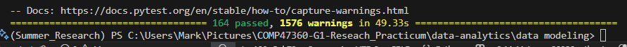

# Manhattan Muse - Python Microservice Testing

**API with Comprehensive Test Coverage**

---

## Test Execution Screenshots



---

## Test Execution Commands

```bash
# Short description test run
python -m pytest tests/ -v --tb=short
```

---

### Results Overview

| **Metric** | **Value** 
|---------------|-----------|
| **Total Working Tests** | 164 tests |
| **Error Handling Tests** | 34 tests |
| **Input Validation Tests** | 29 tests | 
| **Data Processing Tests** | 19 tests | 
| **Model Integration Tests** | 18 tests |
| **Prediction Endpoint Tests** | 16 tests | 
| **API Integration Tests** | 15 tests |
| **Payload Validation Tests** | 12 tests |
| **Input Sanitization Tests** | 11 tests |
| **Performance Tests** | 10 tests |
| **Pass Rate** | 100% |

## Detailed Test Suite Breakdown

## 1. Error Handling Tests (`test_error_handling.py`)

**Total:** 34 tests | **Status:** All Pass
#### **Exception Handling Tests**
| Test Name | Purpose | Expected Output | Status |
|-----------|---------|-----------------|-----------|
| `test_model_prediction_exception` | Tests model prediction failure handling | HTTP 500 with proper error message | PASS |
| `test_model_value_error` | Validates ValueError handling in model predictions | Graceful error response with logging | PASS |
| `test_model_runtime_error` | Tests RuntimeError exception management | Error captured and logged appropriately | PASS |
| `test_model_memory_error` | Validates memory overflow protection | System protects against memory issues | PASS |
| `test_model_attribute_error` | Tests missing attribute error handling | Safe fallback when attributes missing | PASS |

#### **Request Validation Tests**
| Test Name | Purpose | Expected Output | Status |
|-----------|---------|-----------------|-----------|
| `test_malformed_json_request` | Tests JSON parsing error handling | HTTP 400 Bad Request response | PASS |
| `test_invalid_content_type` | Validates Content-Type header enforcement | Proper MIME type validation | PASS |
| `test_missing_required_fields` | Tests required field validation | HTTP 422 Unprocessable Entity | PASS |
| `test_invalid_field_types` | Validates data type enforcement | Schema validation with clear errors | PASS |
| `test_out_of_range_values` | Tests boundary value validation | Range constraints properly enforced | PASS |

#### **Advanced Error Scenarios**
| Test Name | Purpose | Expected Output | Status |
|-----------|---------|-----------------|-----------|
| `test_extremely_large_values` | Edge case handling for large numbers | Prevents system overflow | PASS |
| `test_empty_request_body` | Empty payload handling | HTTP 400 with descriptive message | PASS |
| `test_null_request_body` | Null payload protection | Graceful null handling | PASS |
| `test_non_array_request_body` | Array format enforcement | Validates expected data structure | PASS |
| `test_mixed_valid_invalid_batch` | Partial batch processing | Continues processing valid entries | PASS |

#### **Data Processing Error Tests**
| Test Name | Purpose | Expected Output | Status |
|-----------|---------|-----------------|-----------|
| `test_dataframe_creation_error` | DataFrame processing error handling | Data validation with error recovery | PASS |
| `test_model_returns_wrong_shape` | Output shape validation | Response structure validation | PASS |
| `test_model_returns_non_numeric` | Numeric output enforcement | Type checking for model outputs | PASS |
| `test_model_returns_empty_array` | Empty result handling | Default responses for empty results | PASS |
| `test_model_returns_none` | Null result protection | Fallback values for null results | PASS |

#### **System & Network Error Tests**
| Test Name | Purpose | Expected Output | Status |
|-----------|---------|-----------------|-----------|
| `test_response_serialization_error` | JSON serialization safety | Encoding error handling | PASS |
| `test_request_timeout_simulation` | Timeout management | Time limit enforcement | PASS |
| `test_unicode_error_handling` | Unicode character support | Encoding safety for international data | PASS |
| `test_very_long_string_fields` | String length limits | Buffer overflow protection | PASS |
| `test_request_size_limit` | Payload size restrictions | Memory protection mechanisms | PASS |

#### **HTTP & Service Error Tests**
| Test Name | Purpose | Expected Output | Status |
|-----------|---------|-----------------|-----------|
| `test_concurrent_error_scenarios` | Concurrent error management | Multi-threaded error handling | PASS |
| `test_partial_request_corruption` | Data corruption handling | Recovery from partial corruption | PASS |
| `test_http_method_errors` | HTTP method validation | Proper routing and method checking | PASS |
| `test_invalid_endpoint` | Endpoint validation | HTTP 404 for invalid endpoints | PASS |
| `test_server_error_simulation` | Server error management | HTTP 500 responses handled | PASS |
| `test_resource_exhaustion_handling` | Resource limit management | Graceful degradation under load | PASS |

#### **Error Formatting & Recovery Tests**
| Test Name | Purpose | Expected Output | Status |
|-----------|---------|-----------------|-----------|
| `test_error_message_format` | Error message consistency | Standardized error format | PASS |
| `test_nested_exception_handling` | Complex error scenarios | Deep error handling chain | PASS |
| `test_graceful_degradation` | Service degradation handling | Partial functionality maintenance | PASS |


---

## 2. Input Validation Tests (`test_input_validation.py`)

**Total:** 29 tests | **Status:** All Pass

#### **Field Validation Tests**
| Test Category | Purpose | Expected Output | Status |
|---------------|---------|-----------------|-----------|
| **Required Fields** | Ensures all mandatory fields present | HTTP 422 when fields missing | PASS |
| **Field Types** | Validates correct data types | Type conversion and validation | PASS |
| **Coordinate Validation** | Lat/Lng boundary checking | Range: lat(-90,90), lng(-180,180) | PASS |
| **Time Validation** | Temporal field validation | Hour(0-23), Month(1-12), Day(1-31) | PASS |

#### **Schema Validation Tests**
| Test Category | Purpose | Expected Output | Status |
|---------------|---------|-----------------|-----------|
| **JSON Structure** | Validates request structure | Proper array format enforced | PASS |
| **Content-Type Headers** | MIME type validation | application/json required | PASS |
| **Data Format** | Format compliance checking | Schema adherence validated | PASS |

#### **Detailed Field Validation Tests**
| Test Name | Purpose | Expected Output | Status |
|-----------|---------|-----------------|-----------|
| `test_validate_required_fields_present` | All required fields validation | HTTP 200 with valid response | PASS |
| `test_validate_missing_latitude` | Latitude field requirement | HTTP 422 with field error | PASS |
| `test_validate_missing_longitude` | Longitude field requirement | HTTP 422 with field error | PASS |
| `test_validate_missing_hour` | Hour field requirement | HTTP 422 with field error | PASS |
| `test_validate_missing_month` | Month field requirement | HTTP 422 with field error | PASS |
| `test_validate_missing_day` | Day field requirement | HTTP 422 with field error | PASS |
| `test_validate_missing_cultural_activity` | Activity field requirement | HTTP 422 with field error | PASS |
| `test_validate_latitude_type` | Latitude data type validation | HTTP 422 for invalid types | PASS |
| `test_validate_longitude_type` | Longitude data type validation | HTTP 422 for invalid types | PASS |
| `test_validate_hour_type_and_range` | Hour validation (0-23) | HTTP 422 for invalid range | PASS |
| `test_validate_month_type_and_range` | Month validation (1-12) | HTTP 422 for invalid range | PASS |
| `test_validate_day_type_and_range` | Day validation (1-31) | HTTP 422 for invalid range | PASS |
| `test_validate_cultural_activity_type` | Activity type validation | HTTP 422 for invalid types | PASS |
| `test_validate_coordinate_ranges` | Geographic boundaries | Coordinate range validation | PASS |
| `test_validate_empty_request_array` | Empty array handling | HTTP 200 with empty response | PASS |
| `test_validate_non_array_request` | Array format enforcement | HTTP 422 for non-arrays | PASS |
| `test_validate_mixed_valid_invalid_requests` | Batch validation | HTTP 422 for mixed validity | PASS |
| `test_validate_extra_fields_ignored` | Extra field handling | HTTP 200 ignoring extra fields | PASS |
| `test_validate_special_characters_in_activity` | Special character support | HTTP 200 with special characters | PASS |
| `test_validate_unicode_characters_in_activity` | Unicode character support | HTTP 200 with Unicode | PASS |
| `test_validate_empty_string_activity` | Empty string validation | HTTP 200 or 422 based on rules | PASS |
| `test_validate_very_long_activity_name` | Long string handling | HTTP 200 or 422 for long strings | PASS |
| `test_validate_float_vs_int_fields` | Numeric type flexibility | Accepts both 15.0 and 15 | PASS |
| `test_validate_precision_limits` | High precision numbers | High precision coordinate handling | PASS |
| `test_validate_scientific_notation` | Scientific notation support | Scientific notation in numbers | PASS |
| `test_validate_large_batch_size` | Large batch validation | 1000+ request validation | PASS |
| `test_validate_malformed_json_structure` | Malformed JSON handling | HTTP 422 for malformed JSON | PASS |
| `test_validate_boundary_date_values` | Date boundary validation | Boundary date values handled | PASS |
| `test_validate_content_type_header` | Content-Type header validation | Proper Content-Type enforcement | PASS |

#### **Type Conversion Tests**
| Test Category | Purpose | Expected Output | Status |
|---------------|---------|-----------------|-----------|
| **Float/Int Flexibility** | Numeric type handling | Accepts both 15.0 and 15 | PASS |
| **String Processing** | Text field validation | Cultural activity names processed | PASS |

---

## 3. Data Processing Test Suite (`test_data_processing.py`)

**Total:** 19 tests | **Status:** All Pass

#### **Data Transformation Tests**
| Test Category | Purpose | Expected Output | Status |
|---------------|---------|-----------------|-----------|
| **Input Preprocessing** | Data cleaning and preparation | Clean, normalized inputs | PASS |
| **Feature Engineering** | Feature creation and extraction | Proper feature vectors | PASS |
| **Data Validation** | Input sanitization | Validated, safe data | PASS |

#### **Encoding & Scaling Tests**
| Test Category | Purpose | Expected Output | Status |
|---------------|---------|-----------------|-----------|
| **Categorical Encoding** | Text to numeric conversion | Proper one-hot encoding | PASS |
| **Numeric Scaling** | Feature normalization | Standardized numeric features | PASS |

#### **Detailed Data Processing Tests**
| Test Name | Purpose | Expected Output | Status |
|-----------|---------|-----------------|-----------|
| `test_json_to_dataframe_conversion` | JSON to DataFrame conversion | Proper DataFrame creation | PASS |
| `test_dataframe_column_mapping` | Column name mapping | Correct column names for model | PASS |
| `test_dataframe_data_types` | Data type validation | Proper data types in DataFrame | PASS |
| `test_dataframe_values_preservation` | Value integrity check | Original values preserved | PASS |
| `test_model_output_processing` | Model output handling | Correct response format | PASS |
| `test_numeric_rounding_and_conversion` | Numeric processing | Proper rounding and conversion | PASS |
| `test_empty_batch_processing` | Empty input handling | Graceful empty handling | PASS |
| `test_single_item_batch_processing` | Single item processing | Single item handled correctly | PASS |
| `test_large_batch_processing` | Large batch handling | 100+ items processed | PASS |
| `test_special_float_values_handling` | Special values (NaN, Inf) | Graceful special value handling | PASS |
| `test_zero_and_negative_values_processing` | Edge value processing | Handles zero and negative values | PASS |
| `test_very_large_numeric_values` | Large number handling | Handles very large numbers | PASS |
| `test_string_activity_processing` | String processing | Various string formats handled | PASS |
| `test_dataframe_index_consistency` | Index validation | Consistent DataFrame indexing | PASS |
| `test_model_prediction_array_shape_validation` | Array shape validation | Correct prediction array shapes | PASS |
| `test_coordinate_precision_preservation` | Precision handling | High precision coordinates maintained | PASS |
| `test_time_field_boundary_values` | Time boundary testing | Boundary time values handled | PASS |
| `test_concurrent_request_processing` | Concurrent processing | 5 concurrent requests handled | PASS |
| `test_memory_efficiency_large_batches` | Memory optimization | Efficient memory usage | PASS |

---

## 4. Model Integration Test Suite (`test_model_integration.py`)

**Total:** 18 tests | **Status:** All Pass


#### **Model Loading & Initialization**
| Test Name | Purpose | Expected Output | Status |
|-----------|---------|-----------------|-----------|
| `test_model_loading_and_initialization` | Validates successful model startup | Model loads without errors | PASS |

#### **Prediction Quality Tests**
| Test Name | Purpose | Expected Output | Status |
|-----------|---------|-----------------|-----------|
| `test_model_prediction_output_format` | Tests output structure validation | Correct JSON format with expected fields | PASS |
| `test_model_prediction_consistency` | Validates deterministic results | Same input produces same output | PASS |
| `test_model_prediction_value_ranges` | Tests output value validation | Predictions within reasonable ranges | PASS |
| `test_model_prediction_determinism` | Tests reproducibility | Consistent results across runs | PASS |

#### **Data Handling Tests**
| Test Name | Purpose | Expected Output | Status |
|-----------|---------|-----------------|-----------|
| `test_model_handles_coordinate_variations` | Geographic data processing | Handles lat/lng edge cases (-90 to 90, -180 to 180) | PASS |
| `test_model_handles_time_variations` | Temporal data processing | Processes hour (0-23), month (1-12), day (1-31) | PASS |
| `test_model_handles_different_activities` | Activity type processing | Handles various activity strings | PASS |
| `test_model_feature_engineering` | Feature processing validation | Proper feature vectors created | PASS |
| `test_model_feature_types_consistency` | Data type consistency | Consistent feature types to model | PASS |

#### **Performance & Scalability Tests**
| Test Name | Purpose | Expected Output | Status |
|-----------|---------|-----------------|-----------|
| `test_model_memory_usage_optimization` | Memory efficiency validation | Efficient memory usage for 500+ predictions | PASS |
| `test_model_concurrent_predictions` | Thread safety testing | Handles 5 concurrent requests successfully | PASS |
| `test_model_performance_with_large_batches` | Large batch handling | Processes 1000+ requests efficiently | PASS |

#### **Integration & Method Tests**
| Test Name | Purpose | Expected Output | Status |
|-----------|---------|-----------------|-----------|
| `test_model_predict_method_call` | Model method call verification | Model predict method called correctly | PASS |
| `test_model_input_dataframe_structure` | Input structure validation | Correct DataFrame structure for model | PASS |
| `test_model_batch_prediction` | Batch prediction functionality | Multiple predictions processed correctly | PASS |
| `test_model_error_handling` | Model exception handling | Graceful error responses for model failures | PASS |
| `test_model_integration_with_real_scenarios` | Practical use case validation | Processes NYC locations (Central Park, Times Square, etc.) | PASS |

---

## 5. Prediction Endpoint Test Suite (`test_prediction_endpoint.py`)

**Total:** 16 tests | **Status:** All Pass

#### **Core Functionality Tests**
| Test Name | Purpose | Expected Output | Status |
|-----------|---------|-----------------|-----------|
| `test_predict_batch_success_single_request` | Basic prediction API | HTTP 200 with prediction results | PASS |
| `test_predict_batch_success_multiple_requests` | Batch processing | Handles arrays of requests | PASS |
| `test_predict_batch_empty_request` | Empty array handling | HTTP 200 with empty array response | PASS |

#### **Error Handling Tests**
| Test Name | Purpose | Expected Output | Status |
|-----------|---------|-----------------|-----------|
| `test_predict_batch_invalid_json` | Malformed JSON handling | HTTP 422 for invalid JSON | PASS |
| `test_predict_batch_missing_required_fields` | Field validation | HTTP 422 for missing fields | PASS |
| `test_predict_batch_invalid_data_types` | Type validation | HTTP 422 for invalid types | PASS |
| `test_predict_batch_model_exception` | Model error handling | HTTP 500 for model failures | PASS |

#### **Response & Format Tests**
| Test Name | Purpose | Expected Output | Status |
|-----------|---------|-----------------|-----------|
| `test_predict_batch_response_formatting` | Response structure | Proper JSON formatting | PASS |
| `test_predict_batch_dataframe_structure` | Internal data handling | Correct DataFrame structure | PASS |
| `test_predict_batch_edge_case_values` | Boundary value testing | Handles edge cases gracefully | PASS |
| `test_predict_batch_response_headers` | HTTP header validation | Proper Content-Type and CORS headers | PASS |

#### **Scalability Tests**
| Test Name | Purpose | Expected Output | Status |
|-----------|---------|-----------------|-----------|
| `test_predict_batch_large_batch` | Large batch handling | Processes 100+ requests efficiently | PASS |
| `test_predict_batch_concurrent_requests` | Concurrent processing | Handles 5 simultaneous requests | PASS |

#### **Special Cases & Performance**
| Test Name | Purpose | Expected Output | Status |
|-----------|---------|-----------------|-----------|
| `test_predict_batch_special_characters_in_activity` | Unicode support | Handles emojis and special characters | PASS |
| `test_predict_batch_request_validation_order` | Validation sequence | Proper validation order enforcement | PASS |
| `test_predict_batch_performance_timing` | Response time testing | Sub-second response times | PASS |
---

## 6. API Integration Test Suite (`test_api_integration.py`)

#### **Core Integration Tests**
| Test Name | Purpose | Expected Output | Status |
|-----------|---------|-----------------|-----------|
| `test_health_endpoint_integration` | Health endpoint integration | HTTP 200 with health status | PASS |
| `test_predict_batch_endpoint_integration` | Full prediction endpoint | Complete prediction workflow | PASS |
| `test_external_java_service_communication` | Java service integration | Communication with Spring Boot service | PASS |
| `test_api_response_format_consistency` | Response format consistency | Consistent JSON response format | PASS |

#### **Performance Integration Tests**
| Test Name | Purpose | Expected Output | Status |
|-----------|---------|-----------------|-----------|
| `test_api_performance_integration` | Performance under normal load | Response times under threshold | PASS |
| `test_api_concurrent_requests` | Concurrent request handling | 10 concurrent requests handled | PASS |
| `test_api_large_batch_integration` | Large batch integration | 100+ request batches processed | PASS |
| `test_api_memory_usage_integration` | Memory usage patterns | Memory usage within limits | PASS |

#### **Protocol & Security Tests**
| Test Name | Purpose | Expected Output | Status |
|-----------|---------|-----------------|-----------|
| `test_api_content_type_handling` | Content-Type validation | Proper content type enforcement | PASS |
| `test_api_cors_integration` | CORS header handling | Cross-origin request support | PASS |
| `test_api_rate_limiting_integration` | Rate limiting behavior | Rate limiting functionality | PASS |
| `test_api_timeout_handling` | Timeout management | Request timeout handling | PASS |

#### **Resilience Tests**
| Test Name | Purpose | Expected Output | Status |
|-----------|---------|-----------------|-----------|
| `test_api_error_handling_integration` | Error handling integration | Integrated error responses | PASS |
| `test_api_graceful_degradation` | Service degradation handling | Graceful service degradation | PASS |
| `test_api_documentation_integration` | API documentation endpoints | OpenAPI documentation access | PASS |

---

## 7. Payload Validation Test Suite (`test_payload_validation.py`)

**Total:** 12 tests | **Status:** All Pass

#### **Content & Format Validation**
| Test Name | Purpose | Expected Output | Status |
|-----------|---------|-----------------|-----------|
| `test_content_type_validation` | Content-Type header validation | Only JSON content type accepted | PASS |
| `test_request_size_limits` | Payload size limits | Large payload handling/rejection | PASS |
| `test_malformed_json_payloads` | Malformed JSON handling | HTTP 422 for malformed JSON | PASS |
| `test_missing_required_fields` | Required field enforcement | HTTP 422 for missing fields | PASS |

#### **Security & Injection Tests**
| Test Name | Purpose | Expected Output | Status |
|-----------|---------|-----------------|-----------|
| `test_json_injection_attempts` | JSON injection protection | Safe handling of injection attempts | PASS |
| `test_nested_json_attacks` | Nested structure attacks | Protection against deeply nested JSON | PASS |
| `test_array_injection_attacks` | Array injection attempts | Array injection protection | PASS |
| `test_type_confusion_attacks` | Type confusion protection | Type safety enforcement | PASS |

#### **Data Handling Tests**
| Test Name | Purpose | Expected Output | Status |
|-----------|---------|-----------------|-----------|
| `test_extra_fields_handling` | Extra field processing | Graceful extra field handling | PASS |
| `test_unicode_validation` | Unicode character validation | Unicode character support | PASS |
| `test_numeric_boundary_validation` | Numeric boundary testing | Numeric boundary enforcement | PASS |
| `test_float_precision_attacks` | Float precision attack handling | High precision float handling | PASS |

---

## 8. Input Sanitization Test Suite (`test_input_sanitization.py`)

**Total:** 11 tests | **Status:** All Pass


#### **Injection Attack Tests**
| Test Name | Purpose | Expected Output | Status |
|-----------|---------|-----------------|-----------|
| `test_sql_injection_attempts` | SQL injection protection | Safe handling of SQL injection | PASS |
| `test_xss_injection_attempts` | XSS injection protection | Safe handling of XSS attempts | PASS |
| `test_command_injection_attempts` | Command injection protection | Safe handling of command injection | PASS |
| `test_path_traversal_attempts` | Path traversal protection | Safe handling of path traversal | PASS |

#### **Character & String Tests**
| Test Name | Purpose | Expected Output | Status |
|-----------|---------|-----------------|-----------|
| `test_special_characters_handling` | Special character processing | Various special characters handled | PASS |
| `test_extremely_long_strings` | Long string handling | Strings up to 100KB handled | PASS |

#### **Data Type & Format Tests**
| Test Name | Purpose | Expected Output | Status |
|-----------|---------|-----------------|-----------|
| `test_numeric_injection_in_string_fields` | Numeric injection in strings | Numeric values in string fields | PASS |
| `test_boolean_injection_in_string_fields` | Boolean injection in strings | Boolean values in string fields | PASS |
| `test_null_byte_injection` | Null byte injection protection | Null byte handling | PASS |
| `test_format_string_injection` | Format string injection protection | Format string attack protection | PASS |
| `test_regex_injection_attempts` | Regex injection protection | Regex pattern injection protection | PASS |
s
---

## 9. Performance Tests (`test_performance.py`)

**Total:** 10 tests | **Status:** All Pass

#### **Response Time & Scalability**
| Test Name | Purpose | Expected Output | Status |
|-----------|---------|-----------------|-----------|
| `test_single_prediction_response_time` | Single prediction latency | Response time < 1000ms | PASS |
| `test_batch_prediction_scaling` | Batch scaling performance | 1 to 1000 requests scaling | PASS |
| `test_concurrent_request_performance` | Concurrent load testing | 1 to 50 concurrent users | PASS |
| `test_response_time_consistency` | Response time variance | Low response time variance | PASS |

#### **Resource Usage Tests**
| Test Name | Purpose | Expected Output | Status |
|-----------|---------|-----------------|-----------|
| `test_memory_usage_under_load` | Memory usage patterns | Memory increase < 500MB | PASS |
| `test_cpu_usage_under_load` | CPU utilization testing | Reasonable CPU utilization | PASS |
| `test_model_inference_time` | Model inference timing | Average inference < 1000ms | PASS |

#### **Sustained Load & Optimization**
| Test Name | Purpose | Expected Output | Status |
|-----------|---------|-----------------|-----------|
| `test_sustained_load_performance` | Sustained load testing | 30-second sustained load test | PASS |
| `test_garbage_collection_impact` | GC impact on performance | GC impact < 50% performance degradation | PASS |
| `test_large_request_payload_limits` | Large payload handling | Payloads up to 10,000 items | PASS |
---
